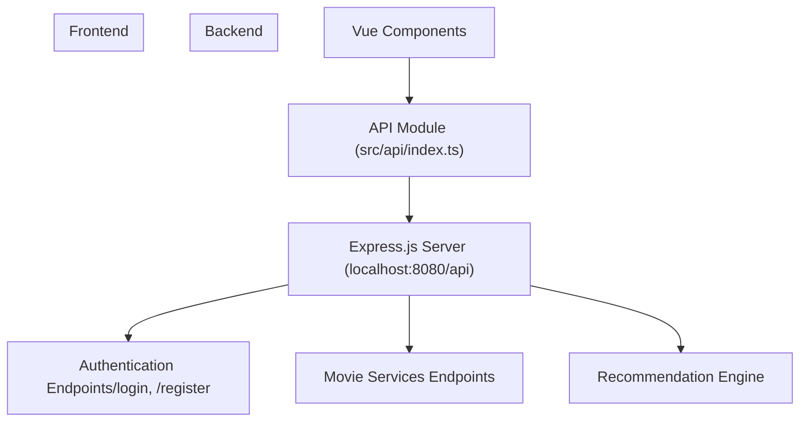
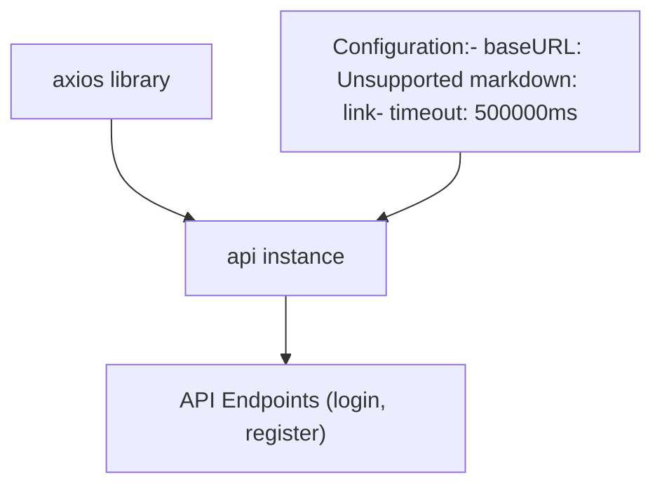
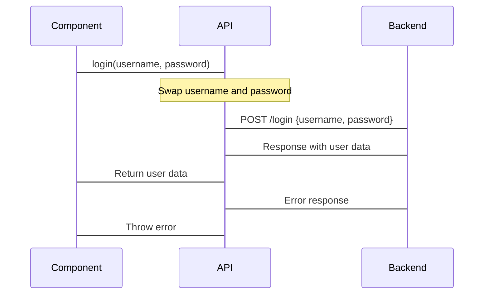
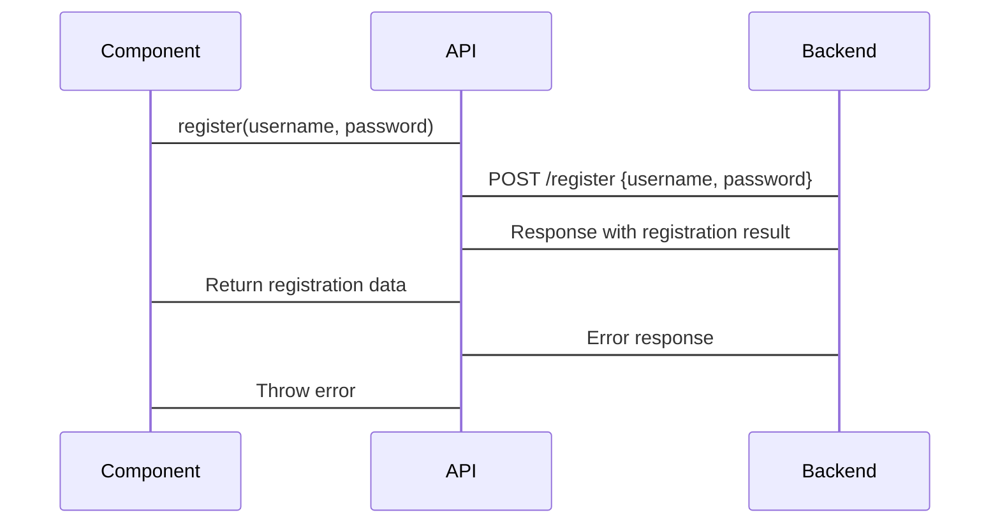
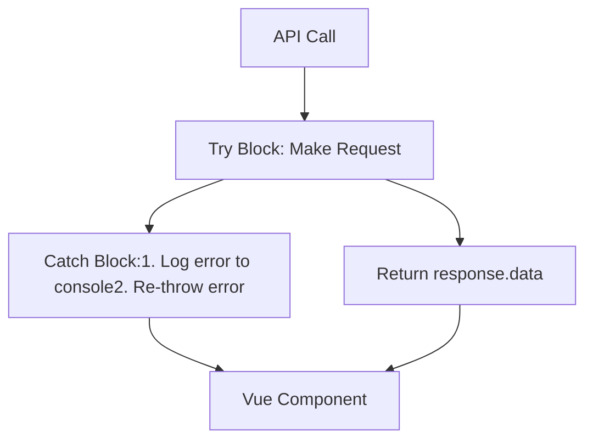
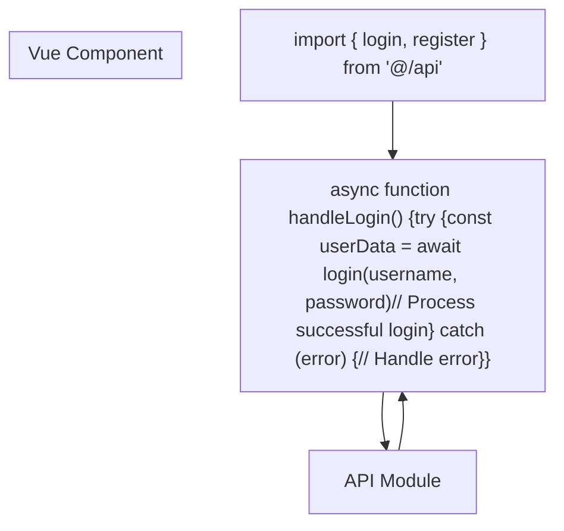

# API Integration

> **Relevant source files**
> * [MovieRecomandAPP/src/api/index.ts](https://github.com/zsqgleRoy/MoviesRecommand/blob/49b41f2a/MovieRecomandAPP/src/api/index.ts)

This document covers how the frontend of the MoviesRecommand system integrates with the backend API. It describes the API configuration, available endpoints, and implementation patterns used throughout the application. For information about state management that works with the API, see [State Management](/zsqgleRoy/MoviesRecommand/3.4-state-management).

## Overview of API Architecture

The MoviesRecommand frontend application communicates with the backend server using a centralized API module based on Axios. This module provides a consistent interface for all API requests and handles common concerns such as base URL configuration, timeout settings, and error handling.



Sources: [MovieRecomandAPP/src/api/index.ts L1-L31](https://github.com/zsqgleRoy/MoviesRecommand/blob/49b41f2a/MovieRecomandAPP/src/api/index.ts#L1-L31)

## API Configuration

The API is configured using Axios, a popular HTTP client for JavaScript. The configuration establishes the base URL and timeout settings for all API requests.



The API is configured with a base URL of `http://localhost:8080/api` and a timeout of 500 seconds (500,000 milliseconds). This configuration creates a reusable Axios instance that is used by all API endpoint functions.

Sources: [MovieRecomandAPP/src/api/index.ts L3-L6](https://github.com/zsqgleRoy/MoviesRecommand/blob/49b41f2a/MovieRecomandAPP/src/api/index.ts#L3-L6)

## Authentication Endpoints

The API module currently implements two authentication-related endpoints:

| Endpoint | Method | Parameters | Description |
| --- | --- | --- | --- |
| `/login` | POST | username, password | Authenticates a user and returns user data |
| `/register` | POST | username, password | Creates a new user account |

### Login Implementation

The login function sends a POST request to the `/login` endpoint with username and password credentials. Note that there is a credential swap in the implementation, where username and password are intentionally reversed before sending.



Sources: [MovieRecomandAPP/src/api/index.ts L9-L20](https://github.com/zsqgleRoy/MoviesRecommand/blob/49b41f2a/MovieRecomandAPP/src/api/index.ts#L9-L20)

### Register Implementation

The register function sends a POST request to the `/register` endpoint with username and password data to create a new user account.



Sources: [MovieRecomandAPP/src/api/index.ts L23-L31](https://github.com/zsqgleRoy/MoviesRecommand/blob/49b41f2a/MovieRecomandAPP/src/api/index.ts#L23-L31)

## Error Handling

Both API endpoints include error handling that:

1. Catches any exceptions during the request
2. Logs the error to the console
3. Re-throws the error to allow the calling component to handle it appropriately

This pattern ensures that errors are visible during development and can be properly managed in the UI.



Sources: [MovieRecomandAPP/src/api/index.ts L10-L19](https://github.com/zsqgleRoy/MoviesRecommand/blob/49b41f2a/MovieRecomandAPP/src/api/index.ts#L10-L19)

 [MovieRecomandAPP/src/api/index.ts L24-L30](https://github.com/zsqgleRoy/MoviesRecommand/blob/49b41f2a/MovieRecomandAPP/src/api/index.ts#L24-L30)

## Using the API in Components

Components can import and use the API functions as follows:

1. Import the required API functions
2. Call the API functions with required parameters
3. Handle the returned Promise with `.then()` and `.catch()` or use `async/await`
4. Process the response or error accordingly



Sources: [MovieRecomandAPP/src/api/index.ts L9-L31](https://github.com/zsqgleRoy/MoviesRecommand/blob/49b41f2a/MovieRecomandAPP/src/api/index.ts#L9-L31)

## Best Practices

When working with the API layer, follow these best practices:

1. **Centralization**: Keep all API calls in the dedicated API module (`src/api/index.ts`) for maintainability
2. **Consistency**: Follow the established pattern for new API endpoints:
* Async functions that return Promises
* Try/catch blocks with appropriate error handling
* Clear function names that match their purpose
3. **Error Handling**: Always include error handling in both the API module and the components that use it
4. **State Management Integration**: Consider integrating API calls with the Pinia store for state management (see [State Management](/zsqgleRoy/MoviesRecommand/3.4-state-management))

## Extending the API Module

When adding new endpoints to the API module, follow this template:

```
export const newEndpoint = async (param1, param2) => {
    try {
        const response = await api.method('/endpoint', { param1, param2 });
        return response.data;
    } catch (error) {
        console.error('Error message:', error);
        throw error;
    }
};
```

Replace:

* `newEndpoint` with a descriptive function name
* `method` with the HTTP method (get, post, put, delete)
* `/endpoint` with the API route
* `param1, param2` with the parameters needed for the request
* `Error message` with an appropriate error description

Sources: [MovieRecomandAPP/src/api/index.ts L9-L31](https://github.com/zsqgleRoy/MoviesRecommand/blob/49b41f2a/MovieRecomandAPP/src/api/index.ts#L9-L31)