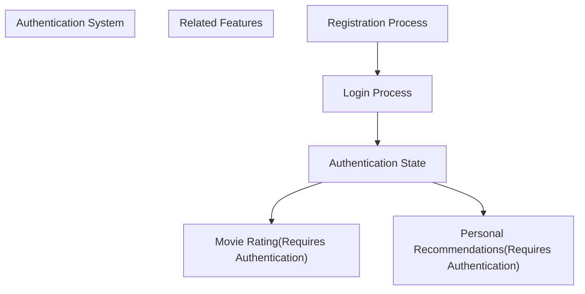
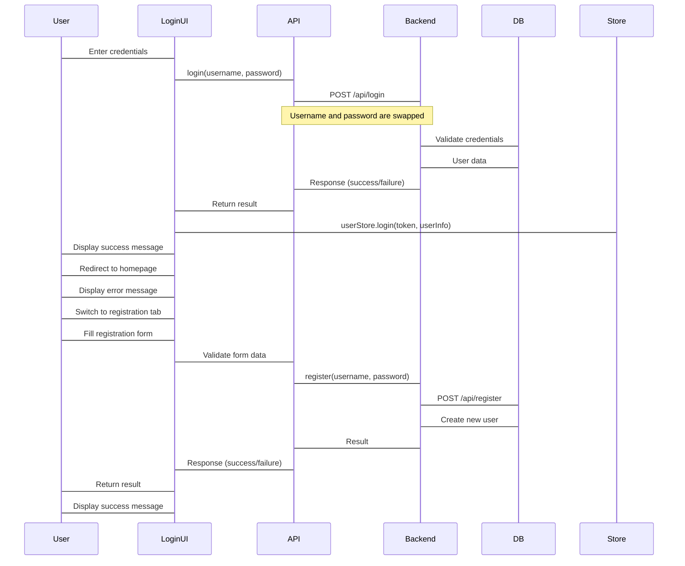
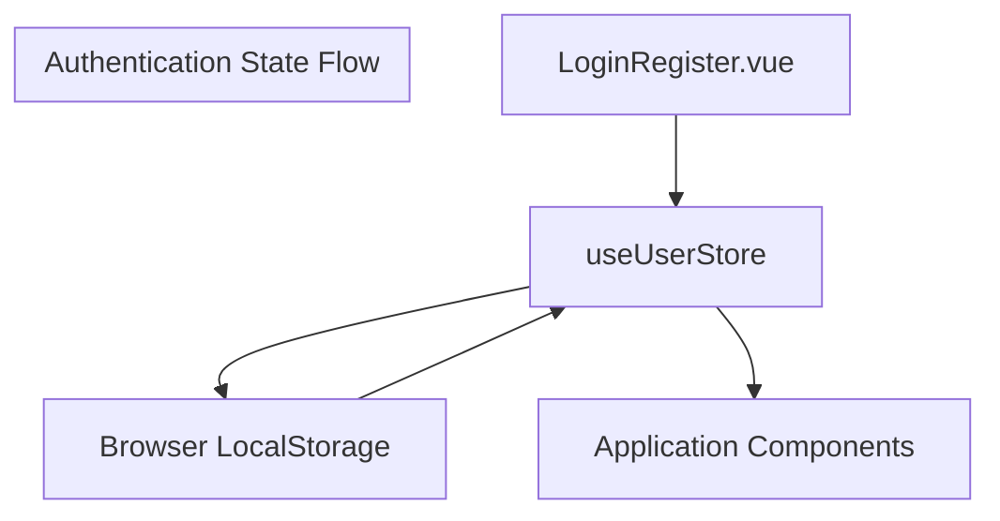

# Authentication

> **Relevant source files**
> * [MovieRecomandAPP/src/api/index.ts](https://github.com/zsqgleRoy/MoviesRecommand/blob/49b41f2a/MovieRecomandAPP/src/api/index.ts)
> * [MovieRecomandAPP/src/components/common/LoginRegister.vue](https://github.com/zsqgleRoy/MoviesRecommand/blob/49b41f2a/MovieRecomandAPP/src/components/common/LoginRegister.vue)

This document details the authentication system implemented in the MovieRecommendation application. It covers the login and registration processes, the frontend components used for authentication, API integration, and state management. For information about the overall system architecture, see [System Architecture](/zsqgleRoy/MoviesRecommand/1.1-system-architecture).

## Authentication Overview

The MovieRecommendation application implements a username/password authentication system that allows users to create accounts and log in to access personalized features such as movie ratings and recommendations. The authentication flow involves frontend components, API services, and backend validation.



Sources: [MovieRecomandAPP/src/components/common/LoginRegister.vue L1-L136](https://github.com/zsqgleRoy/MoviesRecommand/blob/49b41f2a/MovieRecomandAPP/src/components/common/LoginRegister.vue#L1-L136)

## Authentication Flow

The authentication process follows a standard client-server model where credentials are validated against the database. Upon successful authentication, user information is stored in the frontend application state.



Sources:

* [MovieRecomandAPP/src/api/index.ts L8-L31](https://github.com/zsqgleRoy/MoviesRecommand/blob/49b41f2a/MovieRecomandAPP/src/api/index.ts#L8-L31)
* [MovieRecomandAPP/src/components/common/LoginRegister.vue L41-L135](https://github.com/zsqgleRoy/MoviesRecommand/blob/49b41f2a/MovieRecomandAPP/src/components/common/LoginRegister.vue#L41-L135)

## Frontend Authentication Components

The authentication UI is implemented in the `LoginRegister.vue` component, which provides a tabbed interface for both login and registration forms.

### Component Structure

```

```

Sources: [MovieRecomandAPP/src/components/common/LoginRegister.vue L1-L39](https://github.com/zsqgleRoy/MoviesRecommand/blob/49b41f2a/MovieRecomandAPP/src/components/common/LoginRegister.vue#L1-L39)

### Form Validation

The registration form implements client-side validation to ensure:

1. Username and password fields are not empty
2. Password and confirm password fields match

Error messages are displayed using Element Plus alert components when validation fails.

Sources: [MovieRecomandAPP/src/components/common/LoginRegister.vue L109-L120](https://github.com/zsqgleRoy/MoviesRecommand/blob/49b41f2a/MovieRecomandAPP/src/components/common/LoginRegister.vue#L109-L120)

## API Integration

The authentication system integrates with the backend API through dedicated functions in the API module.

### Authentication API Functions

| Function | Purpose | Endpoint | Parameters | Return Value |
| --- | --- | --- | --- | --- |
| `login(username, password)` | Authenticates a user | POST /api/login | username, password | Response data containing status code and message |
| `register(username, password)` | Creates a new user account | POST /api/register | username, password | Response data containing status code and message |

**Note**: The login function contains a peculiarity where username and password are swapped before sending to the API:

```
const tmp = username;
username = password;
password = tmp;
```

### API Configuration

The API module configures axios with:

* Base URL: `http://localhost:8080/api`
* Timeout: 500000ms

Sources:

* [MovieRecomandAPP/src/api/index.ts L1-L31](https://github.com/zsqgleRoy/MoviesRecommand/blob/49b41f2a/MovieRecomandAPP/src/api/index.ts#L1-L31)

## State Management

User authentication state is maintained using Pinia, a state management library for Vue applications.



When a user successfully logs in, the following data is stored:

1. User token (received from the API response)
2. User information (userId and username)

The user store provides reactive state that can be used throughout the application to:

* Determine if a user is authenticated
* Access user information
* Log out the user

Sources: [MovieRecomandAPP/src/components/common/LoginRegister.vue L89-L97](https://github.com/zsqgleRoy/MoviesRecommand/blob/49b41f2a/MovieRecomandAPP/src/components/common/LoginRegister.vue#L89-L97)

## Security Considerations

### Password Handling

Passwords are sent to the backend as plain text through HTTPS requests. The backend is responsible for proper password hashing and storage.

### Authentication Tokens

After successful authentication, the server provides a token which is stored in the user store and likely in local storage for persistence. This token is used for subsequent authenticated requests.

## Integration with Router

After successful login, the user is redirected to the home page using Vue Router:

```
router.push('/');
```

This ensures a smooth user experience where the user is immediately taken to the main application after authentication.

Sources: [MovieRecomandAPP/src/components/common/LoginRegister.vue

97](https://github.com/zsqgleRoy/MoviesRecommand/blob/49b41f2a/MovieRecomandAPP/src/components/common/LoginRegister.vue#L97-L97)

## Error Handling

The authentication system provides error handling at multiple levels:

1. API-level error handling with try-catch blocks
2. Component-level error display using Element Plus alert components
3. User-friendly error messages for common scenarios such as:
* Login failures
* Registration validation errors
* Network errors

Sources:

* [MovieRecomandAPP/src/api/index.ts L16-L19](https://github.com/zsqgleRoy/MoviesRecommand/blob/49b41f2a/MovieRecomandAPP/src/api/index.ts#L16-L19)
* [MovieRecomandAPP/src/api/index.ts L27-L30](https://github.com/zsqgleRoy/MoviesRecommand/blob/49b41f2a/MovieRecomandAPP/src/api/index.ts#L27-L30)
* [MovieRecomandAPP/src/components/common/LoginRegister.vue L17-L19](https://github.com/zsqgleRoy/MoviesRecommand/blob/49b41f2a/MovieRecomandAPP/src/components/common/LoginRegister.vue#L17-L19)
* [MovieRecomandAPP/src/components/common/LoginRegister.vue L34-L36](https://github.com/zsqgleRoy/MoviesRecommand/blob/49b41f2a/MovieRecomandAPP/src/components/common/LoginRegister.vue#L34-L36)