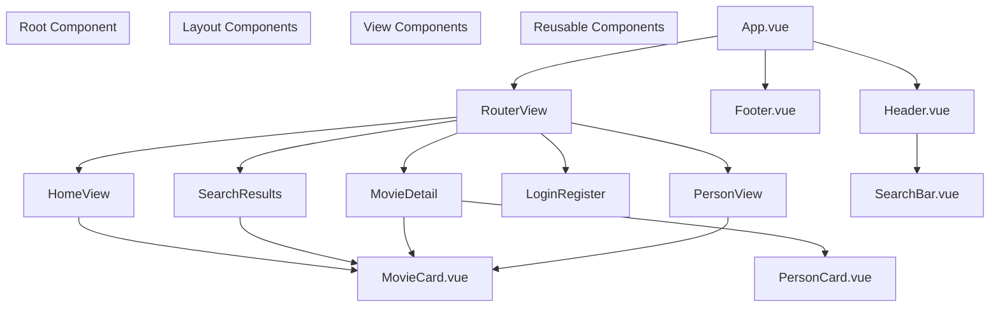
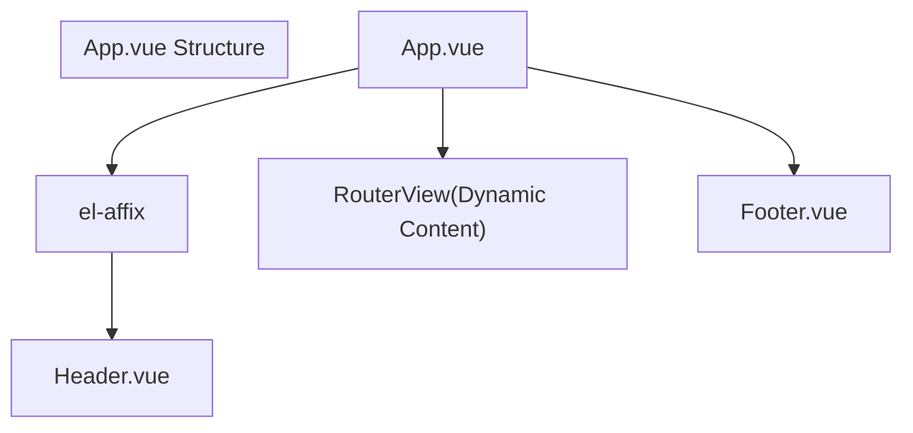
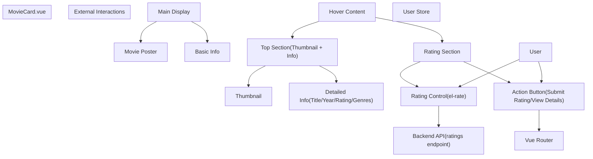
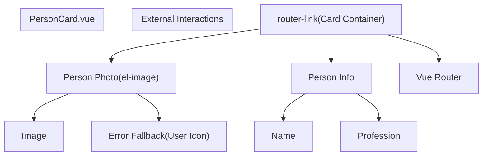
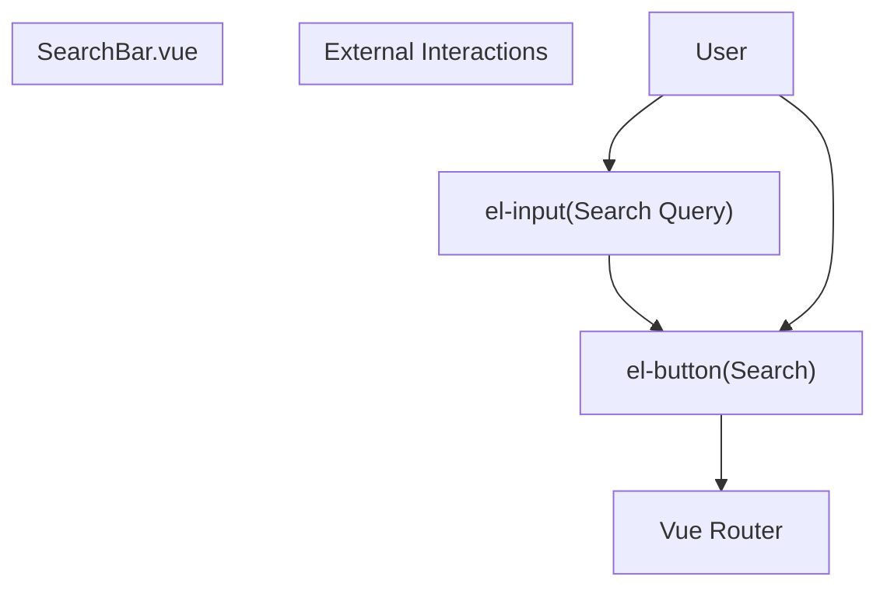
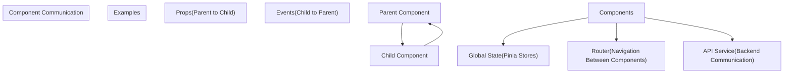
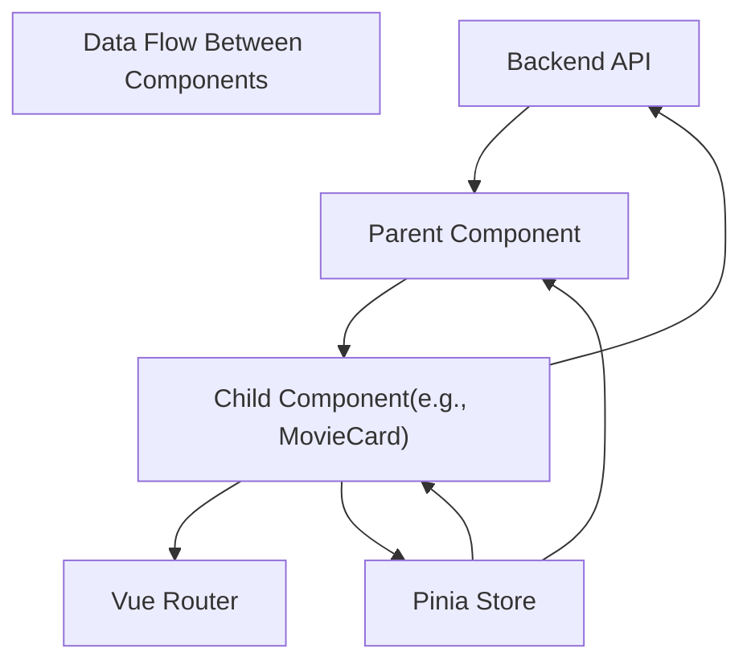
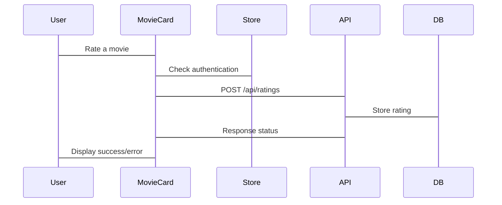

# Component Architecture

> **Relevant source files**
> * [MovieRecomandAPP/src/App.vue](https://github.com/zsqgleRoy/MoviesRecommand/blob/49b41f2a/MovieRecomandAPP/src/App.vue)
> * [MovieRecomandAPP/src/components/MovieCard.vue](https://github.com/zsqgleRoy/MoviesRecommand/blob/49b41f2a/MovieRecomandAPP/src/components/MovieCard.vue)
> * [MovieRecomandAPP/src/components/PersonCard.vue](https://github.com/zsqgleRoy/MoviesRecommand/blob/49b41f2a/MovieRecomandAPP/src/components/PersonCard.vue)
> * [MovieRecomandAPP/src/components/SearchBar.vue](https://github.com/zsqgleRoy/MoviesRecommand/blob/49b41f2a/MovieRecomandAPP/src/components/SearchBar.vue)

## Purpose and Scope

This document describes the component architecture of the MoviesRecommand application. It outlines the structure, organization, and relationships between Vue components that make up the frontend user interface. For information about routing between components, see [Routing](/zsqgleRoy/MoviesRecommand/3.3-routing), and for details on how state is managed across components, see [State Management](/zsqgleRoy/MoviesRecommand/3.4-state-management).

## Overview

The MoviesRecommand frontend application uses Vue 3's Composition API with `<script setup>` syntax. It follows a hierarchical component structure with reusable UI components that communicate through props, events, and global state management.

Sources: [MovieRecomandAPP/src/App.vue L1-L21](https://github.com/zsqgleRoy/MoviesRecommand/blob/49b41f2a/MovieRecomandAPP/src/App.vue#L1-L21)

## Component Hierarchy

Sources: [MovieRecomandAPP/src/App.vue L1-L21](https://github.com/zsqgleRoy/MoviesRecommand/blob/49b41f2a/MovieRecomandAPP/src/App.vue#L1-L21)

 [MovieRecomandAPP/src/components/MovieCard.vue L1-L344](https://github.com/zsqgleRoy/MoviesRecommand/blob/49b41f2a/MovieRecomandAPP/src/components/MovieCard.vue#L1-L344)

 [MovieRecomandAPP/src/components/PersonCard.vue L1-L143](https://github.com/zsqgleRoy/MoviesRecommand/blob/49b41f2a/MovieRecomandAPP/src/components/PersonCard.vue#L1-L143)

 [MovieRecomandAPP/src/components/SearchBar.vue L1-L59](https://github.com/zsqgleRoy/MoviesRecommand/blob/49b41f2a/MovieRecomandAPP/src/components/SearchBar.vue#L1-L59)

## Core Components

### Root Component (App.vue)

The `App.vue` serves as the entry point and root component of the application. It provides the basic layout structure including:

* A fixed header (using Element Plus's `<el-affix>`)
* A central area for route-based content (using Vue Router's `<RouterView>`)
* A footer section

Sources: [MovieRecomandAPP/src/App.vue L1-L21](https://github.com/zsqgleRoy/MoviesRecommand/blob/49b41f2a/MovieRecomandAPP/src/App.vue#L1-L21)

### Reusable Components

The application contains several reusable components that are used throughout the application:

#### MovieCard Component

`MovieCard.vue` is used to display movie information in a card format with:

* Basic movie information (title, year, rating)
* Movie poster
* Genre tags
* Interactive hover effect with expanded information
* Rating functionality

This component communicates with the backend API to submit user ratings.

Sources: [MovieRecomandAPP/src/components/MovieCard.vue L1-L344](https://github.com/zsqgleRoy/MoviesRecommand/blob/49b41f2a/MovieRecomandAPP/src/components/MovieCard.vue#L1-L344)

#### PersonCard Component

`PersonCard.vue` displays information about actors or directors in a card format with:

* Person's photo (with fallback for missing images)
* Name
* Profession information
* Link to the person's detail page

Sources: [MovieRecomandAPP/src/components/PersonCard.vue L1-L143](https://github.com/zsqgleRoy/MoviesRecommand/blob/49b41f2a/MovieRecomandAPP/src/components/PersonCard.vue#L1-L143)

#### SearchBar Component

`SearchBar.vue` provides a search interface with:

* Input field for search queries
* Search button
* Navigation to search results page

Sources: [MovieRecomandAPP/src/components/SearchBar.vue L1-L59](https://github.com/zsqgleRoy/MoviesRecommand/blob/49b41f2a/MovieRecomandAPP/src/components/SearchBar.vue#L1-L59)

## Component Communication Patterns

Components in the MoviesRecommand application communicate using several patterns:

### Props

Components receive data from parent components via props. For example:

* `MovieCard.vue` receives movie data through the `movie` prop
* `PersonCard.vue` receives person data through the `person` prop

### Events

Components communicate upward through Vue's event emission system.

### Global State (Pinia)

Components access and modify shared state through Pinia stores:

* `useUserStore` is used in `MovieCard.vue` to access user authentication state

Sources: [MovieRecomandAPP/src/components/MovieCard.vue L65-L69](https://github.com/zsqgleRoy/MoviesRecommand/blob/49b41f2a/MovieRecomandAPP/src/components/MovieCard.vue#L65-L69)

### Router

Components can navigate between views using Vue Router:

* `SearchBar.vue` navigates to the search results page
* `MovieCard.vue` navigates to movie details page
* `PersonCard.vue` creates links to person detail pages

Sources: [MovieRecomandAPP/src/components/SearchBar.vue L8-L20](https://github.com/zsqgleRoy/MoviesRecommand/blob/49b41f2a/MovieRecomandAPP/src/components/SearchBar.vue#L8-L20)

 [MovieRecomandAPP/src/components/MovieCard.vue L84-L97](https://github.com/zsqgleRoy/MoviesRecommand/blob/49b41f2a/MovieRecomandAPP/src/components/MovieCard.vue#L84-L97)

 [MovieRecomandAPP/src/components/PersonCard.vue L2-L28](https://github.com/zsqgleRoy/MoviesRecommand/blob/49b41f2a/MovieRecomandAPP/src/components/PersonCard.vue#L2-L28)

## Component Data Flow

Sources: [MovieRecomandAPP/src/components/MovieCard.vue L69-L152](https://github.com/zsqgleRoy/MoviesRecommand/blob/49b41f2a/MovieRecomandAPP/src/components/MovieCard.vue#L69-L152)

## Component Styling Approach

The MoviesRecommand application uses a combination of:

* Scoped CSS with SCSS preprocessing (`<style scoped lang="scss">`)
* Responsive design patterns (using media queries)
* Element Plus UI components with customized styling

### Example: MovieCard Styling Structure

The MovieCard component demonstrates a complex styling approach with:

* Nested SCSS structure
* Transition animations for hover effects
* Responsive design adjustments for mobile
* CSS variables for theming

Sources: [MovieRecomandAPP/src/components/MovieCard.vue L156-L343](https://github.com/zsqgleRoy/MoviesRecommand/blob/49b41f2a/MovieRecomandAPP/src/components/MovieCard.vue#L156-L343)

## Component Lifecycle Management

Components leverage Vue 3's Composition API hooks:

| Hook | Usage Example |
| --- | --- |
| `onMounted` | Used in MovieCard to initialize user authentication state |
| `computed` | Used to transform data, like parsing movie genres |
| `ref` | Used to create reactive component state |

Sources: [MovieRecomandAPP/src/components/MovieCard.vue L65-L152](https://github.com/zsqgleRoy/MoviesRecommand/blob/49b41f2a/MovieRecomandAPP/src/components/MovieCard.vue#L65-L152)

## Component Integration with API

Components like `MovieCard.vue` communicate directly with backend APIs:

Sources: [MovieRecomandAPP/src/components/MovieCard.vue L99-L125](https://github.com/zsqgleRoy/MoviesRecommand/blob/49b41f2a/MovieRecomandAPP/src/components/MovieCard.vue#L99-L125)

## Conclusion

The MoviesRecommand component architecture follows Vue 3 best practices with a clear hierarchy, reusable components, and well-defined communication patterns. Components are designed to be modular, responsive, and follow the single-responsibility principle.