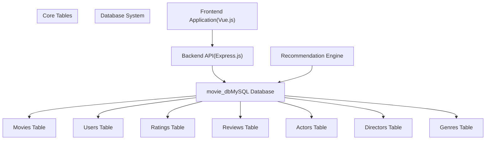
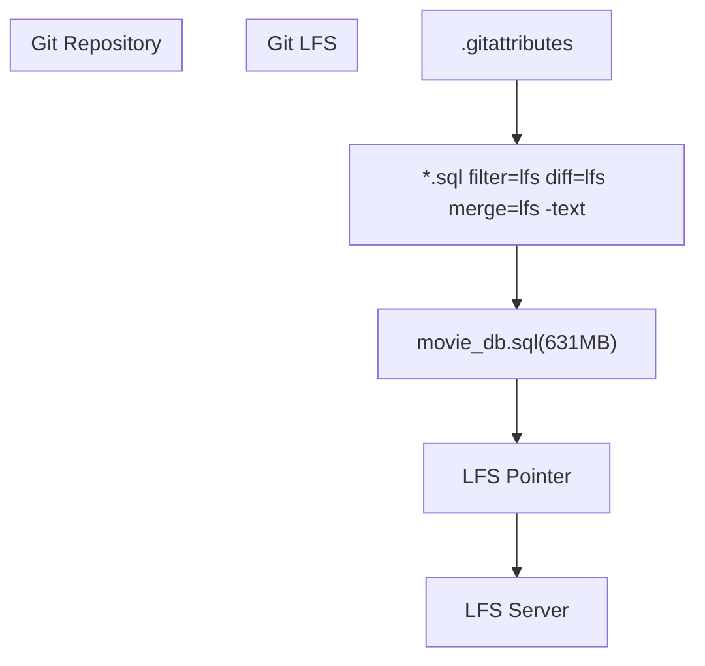
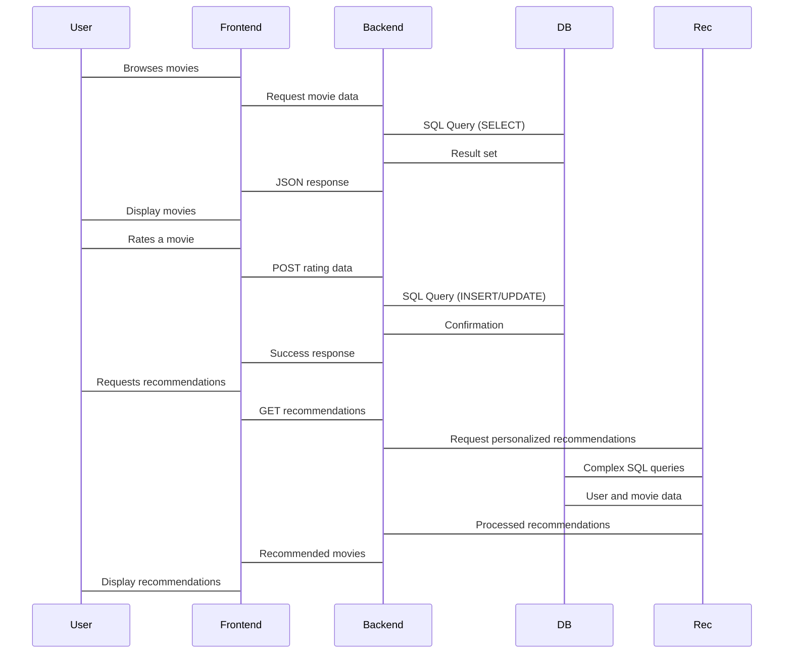

# Database

> **Relevant source files**
> * [.gitattributes](https://github.com/zsqgleRoy/MoviesRecommand/blob/49b41f2a/.gitattributes)
> * [movie_db.sql](https://github.com/zsqgleRoy/MoviesRecommand/blob/49b41f2a/movie_db.sql)

## Purpose and Scope

This document describes the database component of the MoviesRecommand system. The database serves as the central data repository for the application, storing all movie-related information, user data, ratings, and relationships between entities that power the recommendation functionality.

For information about the database schema details, including specific tables, fields, and data types, see [Database Schema](/zsqgleRoy/MoviesRecommand/2.1-database-schema). For information about entity relationships in the database, see [Entity Relationships](/zsqgleRoy/MoviesRecommand/2.2-entity-relationships).

## Overview

The MoviesRecommand system uses a MySQL database to store and manage all application data. The database is designed to efficiently handle queries related to movie information retrieval and recommendation operations.



Sources: [movie_db.sql](https://github.com/zsqgleRoy/MoviesRecommand/blob/49b41f2a/movie_db.sql)

## Database Structure

The database consists of several interconnected tables that store different types of data. Below is a simplified entity-relationship diagram showing the main tables and their relationships:

```
#mermaid-anu32tij7cm{font-family:ui-sans-serif,-apple-system,system-ui,Segoe UI,Helvetica;font-size:16px;fill:#333;}@keyframes edge-animation-frame{from{stroke-dashoffset:0;}}@keyframes dash{to{stroke-dashoffset:0;}}#mermaid-anu32tij7cm .edge-animation-slow{stroke-dasharray:9,5!important;stroke-dashoffset:900;animation:dash 50s linear infinite;stroke-linecap:round;}#mermaid-anu32tij7cm .edge-animation-fast{stroke-dasharray:9,5!important;stroke-dashoffset:900;animation:dash 20s linear infinite;stroke-linecap:round;}#mermaid-anu32tij7cm .error-icon{fill:#dddddd;}#mermaid-anu32tij7cm .error-text{fill:#222222;stroke:#222222;}#mermaid-anu32tij7cm .edge-thickness-normal{stroke-width:1px;}#mermaid-anu32tij7cm .edge-thickness-thick{stroke-width:3.5px;}#mermaid-anu32tij7cm .edge-pattern-solid{stroke-dasharray:0;}#mermaid-anu32tij7cm .edge-thickness-invisible{stroke-width:0;fill:none;}#mermaid-anu32tij7cm .edge-pattern-dashed{stroke-dasharray:3;}#mermaid-anu32tij7cm .edge-pattern-dotted{stroke-dasharray:2;}#mermaid-anu32tij7cm .marker{fill:#999;stroke:#999;}#mermaid-anu32tij7cm .marker.cross{stroke:#999;}#mermaid-anu32tij7cm svg{font-family:ui-sans-serif,-apple-system,system-ui,Segoe UI,Helvetica;font-size:16px;}#mermaid-anu32tij7cm p{margin:0;}#mermaid-anu32tij7cm .entityBox{fill:#ffffff;stroke:#dddddd;}#mermaid-anu32tij7cm .relationshipLabelBox{fill:#dddddd;opacity:0.7;background-color:#dddddd;}#mermaid-anu32tij7cm .relationshipLabelBox rect{opacity:0.5;}#mermaid-anu32tij7cm .labelBkg{background-color:rgba(221, 221, 221, 0.5);}#mermaid-anu32tij7cm .edgeLabel .label{fill:#dddddd;font-size:14px;}#mermaid-anu32tij7cm .label{font-family:ui-sans-serif,-apple-system,system-ui,Segoe UI,Helvetica;color:#333;}#mermaid-anu32tij7cm .edge-pattern-dashed{stroke-dasharray:8,8;}#mermaid-anu32tij7cm .node rect,#mermaid-anu32tij7cm .node circle,#mermaid-anu32tij7cm .node ellipse,#mermaid-anu32tij7cm .node polygon{fill:#ffffff;stroke:#dddddd;stroke-width:1px;}#mermaid-anu32tij7cm .relationshipLine{stroke:#999;stroke-width:1;fill:none;}#mermaid-anu32tij7cm .marker{fill:none!important;stroke:#999!important;stroke-width:1;}#mermaid-anu32tij7cm :root{--mermaid-font-family:"trebuchet ms",verdana,arial,sans-serif;}receivesgivesreceiveswriteshasappears inhasdirectsbelongs tocategorizesMOVIESintmovie_idPKstringtitledaterelease_datestringoverviewfloatpopularitystringposter_pathUSERSintuser_idPKstringusernamestringemailstringpassword_hashRATINGSintrating_idPKintuser_idFKintmovie_idFKfloatratingdatetimestampREVIEWSintreview_idPKintuser_idFKintmovie_idFKstringcontentdatetimestampACTORSintactor_idPKstringnamestringprofile_pathDIRECTORSintdirector_idPKstringnamestringprofile_pathGENRESintgenre_idPKstringnameMOVIE_ACTORSintmovie_idFKintactor_idFKMOVIE_DIRECTORSintmovie_idFKintdirector_idFKMOVIE_GENRESintmovie_idFKintgenre_idFK
```

Sources: [movie_db.sql](https://github.com/zsqgleRoy/MoviesRecommand/blob/49b41f2a/movie_db.sql)

### Key Tables

| Table | Description | Key Fields | Relationships |
| --- | --- | --- | --- |
| Movies | Stores movie details | movie_id, title, release_date, overview | Connected to actors, directors, genres, ratings, reviews |
| Users | Stores user account information | user_id, username, email | Creates ratings and reviews |
| Ratings | Stores user ratings for movies | rating_id, user_id, movie_id, rating | Links users to movies they've rated |
| Reviews | Stores user reviews for movies | review_id, user_id, movie_id, content | Links users to movies they've reviewed |
| Actors | Stores actor information | actor_id, name | Connected to movies through movie_actors |
| Directors | Stores director information | director_id, name | Connected to movies through movie_directors |
| Genres | Stores genre categories | genre_id, name | Connected to movies through movie_genres |

Sources: [movie_db.sql](https://github.com/zsqgleRoy/MoviesRecommand/blob/49b41f2a/movie_db.sql)

## Database File Management

The database schema is stored in the `movie_db.sql` file, which is a large SQL file (631MB) containing the database structure and possibly seed data. Due to its size, this file is managed using Git LFS (Large File Storage).

### Git LFS Configuration

The repository uses Git LFS to manage the large SQL database file. This configuration is specified in the `.gitattributes` file:



Sources: [.gitattributes

1](https://github.com/zsqgleRoy/MoviesRecommand/blob/49b41f2a/.gitattributes#L1-L1)

 [movie_db.sql L1-L3](https://github.com/zsqgleRoy/MoviesRecommand/blob/49b41f2a/movie_db.sql#L1-L3)

Git LFS replaces the actual SQL file in the repository with a small pointer file, while the actual content is stored on a separate LFS server. When you clone the repository, you get the pointer file by default, and the actual content is downloaded only when needed.

## Database Integration

The database integrates with the rest of the system components as follows:



Sources: [movie_db.sql](https://github.com/zsqgleRoy/MoviesRecommand/blob/49b41f2a/movie_db.sql)

### Data Access Patterns

The database is primarily accessed through the backend API which serves as an intermediary between the frontend application and the database. This ensures data integrity and security by preventing direct database access from the client side.

Common data access patterns include:

1. **Read operations**: Retrieving movie listings, user profiles, and ratings
2. **Write operations**: Creating new user accounts, adding or updating ratings and reviews
3. **Analytical queries**: Complex queries used by the recommendation engine to analyze user preferences and suggest relevant movies

## Performance Considerations

The database is designed to handle:

* Efficient queries for movie browsing and searching
* Fast rating and review operations
* Complex joins for retrieving related data (e.g., movies with their genres, actors, and directors)
* Analytical queries for generating recommendations

Performance optimizations include:

* Proper indexing on frequently queried columns
* Normalized structure to minimize redundancy
* Junction tables for many-to-many relationships

## Summary

The database serves as the foundation of the MoviesRecommand system, storing all persistent data required for the application's functionality. Its well-structured design enables efficient data retrieval and manipulation, supporting features like movie browsing, user ratings, and personalized recommendations.

Sources: [movie_db.sql](https://github.com/zsqgleRoy/MoviesRecommand/blob/49b41f2a/movie_db.sql)

 [.gitattributes

1](https://github.com/zsqgleRoy/MoviesRecommand/blob/49b41f2a/.gitattributes#L1-L1)