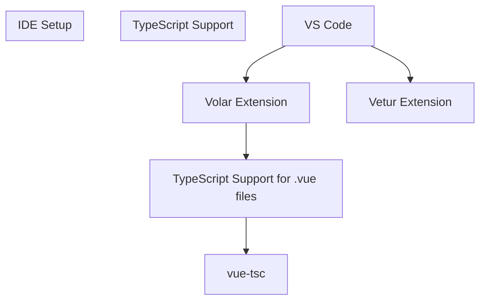
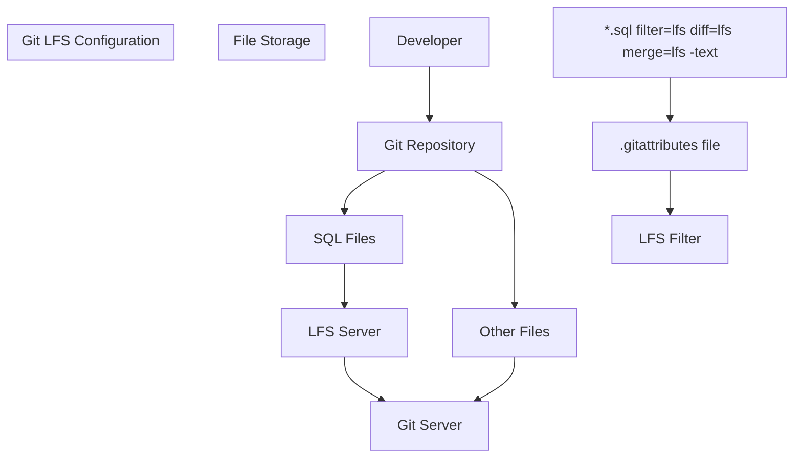
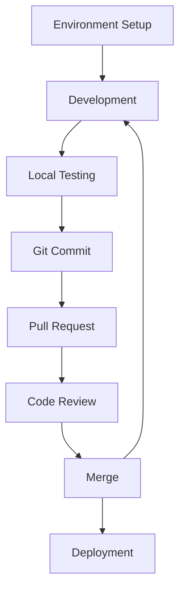
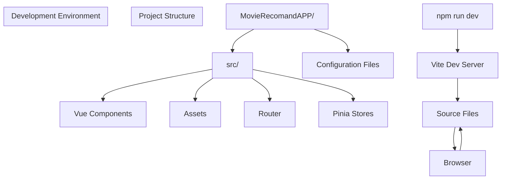
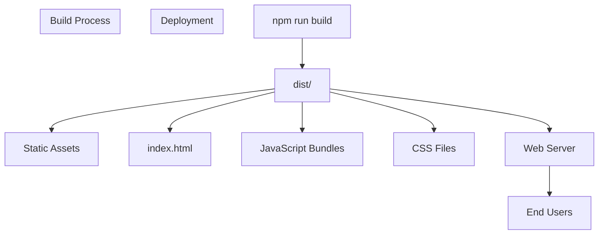

# Development Workflow

> **Relevant source files**
> * [.gitattributes](https://github.com/zsqgleRoy/MoviesRecommand/blob/49b41f2a/.gitattributes)
> * [MovieRecomandAPP/.gitignore](https://github.com/zsqgleRoy/MoviesRecommand/blob/49b41f2a/MovieRecomandAPP/.gitignore)
> * [MovieRecomandAPP/README.md](https://github.com/zsqgleRoy/MoviesRecommand/blob/49b41f2a/MovieRecomandAPP/README.md)

## Purpose and Scope

This document describes the development workflow for the MovieRecommendation system, focusing on environment setup, Git configuration with LFS for SQL files, and the development cycle. For information about the system architecture, see [System Architecture](/zsqgleRoy/MoviesRecommand/1.1-system-architecture), and for database details, see [Database](/zsqgleRoy/MoviesRecommand/2-database).

## Environment Setup

### IDE Configuration

The recommended development environment for this project is VS Code with the Volar extension for Vue.js support.



Sources: [MovieRecomandAPP/README.md L5-L11](https://github.com/zsqgleRoy/MoviesRecommand/blob/49b41f2a/MovieRecomandAPP/README.md#L5-L11)

### Project Installation

To set up the project locally, follow these steps:

1. Clone the repository
2. Install dependencies
3. Start the development server

```
# Install project dependencies
npm install

# Start development server with hot-reload
npm run dev

# Build for production
npm run build
```

Sources: [MovieRecomandAPP/README.md L17-L33](https://github.com/zsqgleRoy/MoviesRecommand/blob/49b41f2a/MovieRecomandAPP/README.md#L17-L33)

## Git Workflow

The project uses Git for version control with special handling for SQL files through Git Large File Storage (LFS).

### Git LFS Configuration

Large SQL files are managed using Git LFS to keep the repository size manageable and improve performance.



Sources: [.gitattributes

1-5](https://github.com/zsqgleRoy/MoviesRecommand/blob/49b41f2a/.gitattributes#L1-L5)

### Working with LFS-Tracked Files

When working with SQL files in this project, remember that:

1. Git LFS must be installed on your system
2. SQL files are automatically tracked by LFS based on the `.gitattributes` configuration
3. When cloning the repository, only pointers are downloaded initially
4. Actual SQL files are downloaded on demand when needed

## Development Cycle

The typical development workflow follows this pattern:



### Local Development

The Vue 3 and Vite-based frontend provides a fast development experience with hot module replacement.



Sources: [MovieRecomandAPP/README.md L23-L27](https://github.com/zsqgleRoy/MoviesRecommand/blob/49b41f2a/MovieRecomandAPP/README.md#L23-L27)

### Git Ignore Configuration

The project's `.gitignore` file excludes specific files and directories from version control:

| Category | Ignored Items |
| --- | --- |
| Logs | `logs`, `*.log`, `npm-debug.log*`, `yarn-debug.log*`, `yarn-error.log*`, `pnpm-debug.log*`, `lerna-debug.log*` |
| Build outputs | `dist`, `dist-ssr`, `coverage` |
| Dependencies | `node_modules` |
| Local files | `*.local`, `.DS_Store` |
| Testing artifacts | `/cypress/videos/`, `/cypress/screenshots/` |
| Editor files | `.vscode/*` (except extensions.json), `.idea`, `*.suo`, `*.ntvs*`, `*.njsproj`, `*.sln`, `*.sw?` |
| TypeScript | `*.tsbuildinfo` |

Sources: [MovieRecomandAPP/.gitignore L1-L31](https://github.com/zsqgleRoy/MoviesRecommand/blob/49b41f2a/MovieRecomandAPP/.gitignore#L1-L31)

## Build and Deployment

### Production Build

To prepare the application for production deployment:

```
npm run build
```

This command:

1. Type-checks the entire application
2. Compiles and minifies all components
3. Outputs production-ready files to the `dist/` directory

Sources: [MovieRecomandAPP/README.md L29-L33](https://github.com/zsqgleRoy/MoviesRecommand/blob/49b41f2a/MovieRecomandAPP/README.md#L29-L33)

### Deployment Workflow



Sources: [MovieRecomandAPP/README.md L29-L33](https://github.com/zsqgleRoy/MoviesRecommand/blob/49b41f2a/MovieRecomandAPP/README.md#L29-L33)

## Development Best Practices

1. **Regular commits**: Make small, focused commits with descriptive messages
2. **SQL file handling**: Be careful when working with SQL files as they are handled by LFS
3. **Type checking**: Ensure TypeScript types are properly defined to catch errors early
4. **Component design**: Keep Vue components modular and reusable
5. **Testing**: Test locally before pushing changes

By following this workflow, developers can effectively contribute to the MovieRecommendation system while maintaining code quality and repository health.