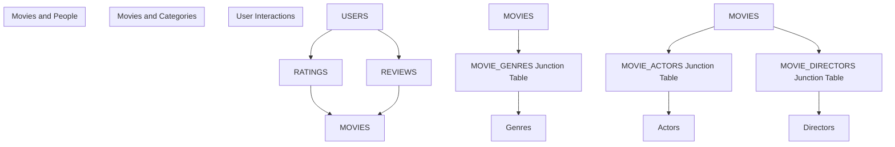
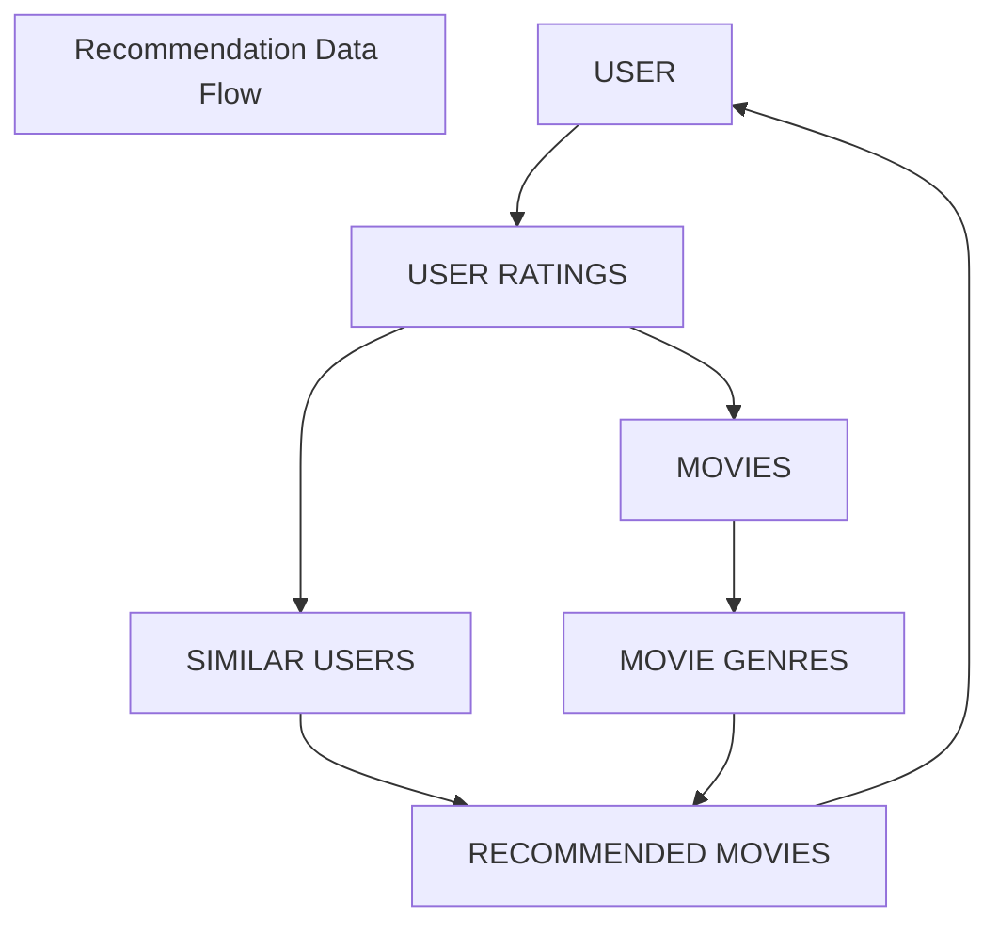

# Entity Relationships

> **Relevant source files**
> * [movie_db.sql](https://github.com/zsqgleRoy/MoviesRecommand/blob/49b41f2a/movie_db.sql)

This document describes the entity relationships within the MovieRecommendation database system. It explains how different entities such as movies, users, ratings, genres, and people (actors, directors) relate to each other within the database schema. For specific details about table structures and field definitions, see [Database Schema](/zsqgleRoy/MoviesRecommand/2.1-database-schema).

## Overview of Database Entities

The MovieRecommendation system's database is structured around several core entities that store and organize data essential for the application's functionality. Understanding these relationships is crucial for effective development and maintenance of the system.

### Entity Relationship Diagram

```
#mermaid-8dfiujqn8f{font-family:ui-sans-serif,-apple-system,system-ui,Segoe UI,Helvetica;font-size:16px;fill:#333;}@keyframes edge-animation-frame{from{stroke-dashoffset:0;}}@keyframes dash{to{stroke-dashoffset:0;}}#mermaid-8dfiujqn8f .edge-animation-slow{stroke-dasharray:9,5!important;stroke-dashoffset:900;animation:dash 50s linear infinite;stroke-linecap:round;}#mermaid-8dfiujqn8f .edge-animation-fast{stroke-dasharray:9,5!important;stroke-dashoffset:900;animation:dash 20s linear infinite;stroke-linecap:round;}#mermaid-8dfiujqn8f .error-icon{fill:#dddddd;}#mermaid-8dfiujqn8f .error-text{fill:#222222;stroke:#222222;}#mermaid-8dfiujqn8f .edge-thickness-normal{stroke-width:1px;}#mermaid-8dfiujqn8f .edge-thickness-thick{stroke-width:3.5px;}#mermaid-8dfiujqn8f .edge-pattern-solid{stroke-dasharray:0;}#mermaid-8dfiujqn8f .edge-thickness-invisible{stroke-width:0;fill:none;}#mermaid-8dfiujqn8f .edge-pattern-dashed{stroke-dasharray:3;}#mermaid-8dfiujqn8f .edge-pattern-dotted{stroke-dasharray:2;}#mermaid-8dfiujqn8f .marker{fill:#999;stroke:#999;}#mermaid-8dfiujqn8f .marker.cross{stroke:#999;}#mermaid-8dfiujqn8f svg{font-family:ui-sans-serif,-apple-system,system-ui,Segoe UI,Helvetica;font-size:16px;}#mermaid-8dfiujqn8f p{margin:0;}#mermaid-8dfiujqn8f .entityBox{fill:#ffffff;stroke:#dddddd;}#mermaid-8dfiujqn8f .relationshipLabelBox{fill:#dddddd;opacity:0.7;background-color:#dddddd;}#mermaid-8dfiujqn8f .relationshipLabelBox rect{opacity:0.5;}#mermaid-8dfiujqn8f .labelBkg{background-color:rgba(221, 221, 221, 0.5);}#mermaid-8dfiujqn8f .edgeLabel .label{fill:#dddddd;font-size:14px;}#mermaid-8dfiujqn8f .label{font-family:ui-sans-serif,-apple-system,system-ui,Segoe UI,Helvetica;color:#333;}#mermaid-8dfiujqn8f .edge-pattern-dashed{stroke-dasharray:8,8;}#mermaid-8dfiujqn8f .node rect,#mermaid-8dfiujqn8f .node circle,#mermaid-8dfiujqn8f .node ellipse,#mermaid-8dfiujqn8f .node polygon{fill:#ffffff;stroke:#dddddd;stroke-width:1px;}#mermaid-8dfiujqn8f .relationshipLine{stroke:#999;stroke-width:1;fill:none;}#mermaid-8dfiujqn8f .marker{fill:none!important;stroke:#999!important;stroke-width:1;}#mermaid-8dfiujqn8f :root{--mermaid-font-family:"trebuchet ms",verdana,arial,sans-serif;}receivescreateshaswriteshasappears_indirected_bydirectscategorized_ascategorizesMOVIESintmovie_idPKstringtitledaterelease_datestringoverviewfloatpopularitystringposter_pathUSERSintuser_idPKstringusernamestringemailstringpassword_hashdateregistration_dateRATINGSintrating_idPKintuser_idFKintmovie_idFKfloatrating_valuedaterating_dateREVIEWSintreview_idPKintuser_idFKintmovie_idFKstringreview_textdatereview_dateACTORSintactor_idPKstringnamestringprofile_pathdatebirth_dateMOVIE_ACTORSintmovie_idFKintactor_idFKstringcharacterDIRECTORSintdirector_idPKstringnamestringprofile_pathdatebirth_dateMOVIE_DIRECTORSintmovie_idFKintdirector_idFKGENRESintgenre_idPKstringnameMOVIE_GENRESintmovie_idFKintgenre_idFK
```

Sources: movie_db.sql

## Core Entities and Relationships

### Movies Entity

Movies are the central entity in the system. Each movie record contains basic information about a film, such as its title, release date, overview, and popularity rating.

#### Key Relationships:

* One movie can have many actors (many-to-many relationship through MOVIE_ACTORS junction table)
* One movie can have many directors (many-to-many relationship through MOVIE_DIRECTORS junction table)
* One movie can belong to many genres (many-to-many relationship through MOVIE_GENRES junction table)
* One movie can receive many ratings from different users (one-to-many relationship with RATINGS)
* One movie can have many reviews from different users (one-to-many relationship with REVIEWS)

### Users Entity

Users represent the registered members of the platform who interact with movies by rating them and writing reviews.

#### Key Relationships:

* One user can rate many movies (one-to-many relationship with RATINGS)
* One user can review many movies (one-to-many relationship with REVIEWS)

### Ratings Entity

Ratings store the numeric evaluations that users give to movies, typically on a scale (e.g., 1-5 or 1-10).

#### Key Relationships:

* Each rating is associated with exactly one movie (many-to-one relationship with MOVIES)
* Each rating is created by exactly one user (many-to-one relationship with USERS)

### Reviews Entity

Reviews contain textual feedback that users provide about movies.

#### Key Relationships:

* Each review is associated with exactly one movie (many-to-one relationship with MOVIES)
* Each review is written by exactly one user (many-to-one relationship with USERS)

### Actors Entity

Actors represent the performers who appear in movies.

#### Key Relationships:

* One actor can appear in many movies (many-to-many relationship with MOVIES through MOVIE_ACTORS)

### Directors Entity

Directors are the individuals who direct movies.

#### Key Relationships:

* One director can direct many movies (many-to-many relationship with MOVIES through MOVIE_DIRECTORS)

### Genres Entity

Genres represent categories or types of movies (e.g., Action, Comedy, Drama).

#### Key Relationships:

* One genre can categorize many movies (many-to-many relationship with MOVIES through MOVIE_GENRES)

Sources: movie_db.sql

## Relationship Categories and Junction Tables

The following diagram illustrates how the relationships are organized into logical categories with junction tables resolving many-to-many relationships:



Sources: movie_db.sql

### Movie-Actor Relationship (Many-to-Many)

* Each movie can feature multiple actors
* Each actor can appear in multiple movies
* The MOVIE_ACTORS junction table resolves this many-to-many relationship
* The junction table stores the character name played by the actor in the movie

### Movie-Director Relationship (Many-to-Many)

* Each movie can have multiple directors (though most typically have one)
* Each director can direct multiple movies
* The MOVIE_DIRECTORS junction table resolves this many-to-many relationship

### Movie-Genre Relationship (Many-to-Many)

* Each movie can belong to multiple genres (e.g., a film might be both Action and Comedy)
* Each genre can categorize multiple movies
* The MOVIE_GENRES junction table resolves this many-to-many relationship

### User-Movie Rating Relationship (Many-to-Many)

* Each user can rate multiple movies
* Each movie can be rated by multiple users
* The RATINGS entity serves as the junction table with additional attributes (rating value, date)

### User-Movie Review Relationship (Many-to-Many)

* Each user can review multiple movies
* Each movie can be reviewed by multiple users
* The REVIEWS entity serves as the junction table with additional attributes (review text, date)

## Entity Relationships in the Recommendation Engine

The following diagram illustrates how entity relationships support the movie recommendation functionality:



Sources: movie_db.sql

The recommendation engine uses the entity relationships to:

1. Track a user's movie ratings
2. Identify movies with similar genre combinations
3. Find users with similar taste profiles
4. Recommend movies that similar users have rated highly
5. Recommend movies from genres the user has historically enjoyed

## Database Relationship Design Principles

The entity relationship design follows several key database principles:

1. **Normalization**: The database schema is normalized to reduce data redundancy and improve integrity. For example, actor information is stored once in the ACTORS table rather than repeatedly in the MOVIES table.
2. **Junction Tables**: Many-to-many relationships are properly resolved using junction tables (MOVIE_ACTORS, MOVIE_DIRECTORS, MOVIE_GENRES).
3. **Foreign Key Constraints**: Relationships are enforced through foreign key constraints to maintain referential integrity between related tables.
4. **Atomicity**: Data is stored in atomic form, with each piece of information broken down to its smallest logical part.

| Relationship Type | Example | Implementation |
| --- | --- | --- |
| One-to-Many | A user creates many ratings | Foreign key in RATINGS references USERS |
| Many-to-Many | Movies have many actors, actors appear in many movies | Junction table (MOVIE_ACTORS) with foreign keys to both entities |
| Many-to-Many with Attributes | User ratings for movies with rating value | RATINGS table serves as junction table with additional attributes |

Sources: movie_db.sql

## Impact on Application Features

The entity relationships directly enable the following application features:

### Movie Browsing and Filtering

* Browse movies by genre using MOVIE_GENRES relationship
* Find movies by specific actor using MOVIE_ACTORS relationship
* Find movies by specific director using MOVIE_DIRECTORS relationship

### User Interaction Features

* Display average ratings for movies by aggregating the RATINGS relationship
* Show individual user ratings through the USER→RATINGS→MOVIES relationship
* Present user reviews for each movie through the USER→REVIEWS→MOVIES relationship

### Recommendation Engine

* Analyze user ratings to identify preference patterns
* Identify movies with similar genre combinations using MOVIE_GENRES
* Find users with similar taste profiles by comparing ratings
* Recommend movies based on actors or directors the user has favorably rated

Sources: movie_db.sql