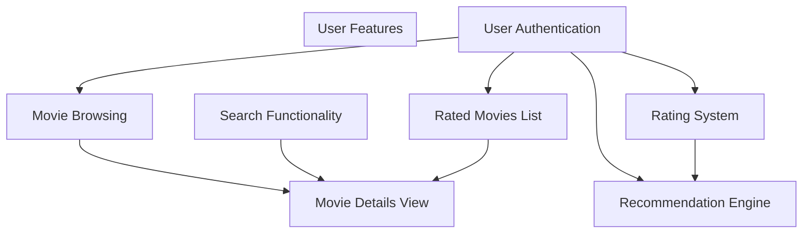
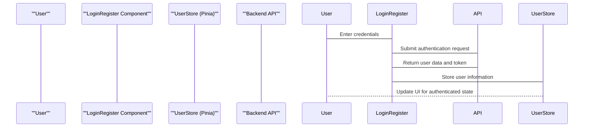
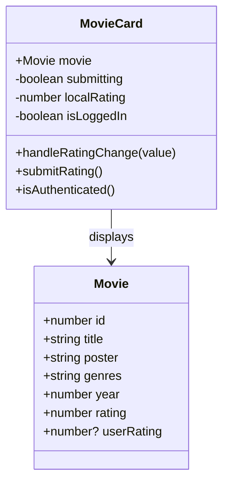
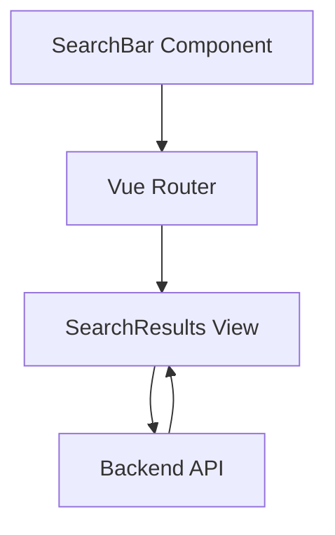
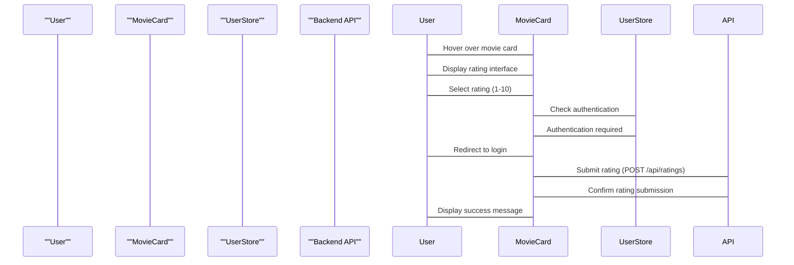
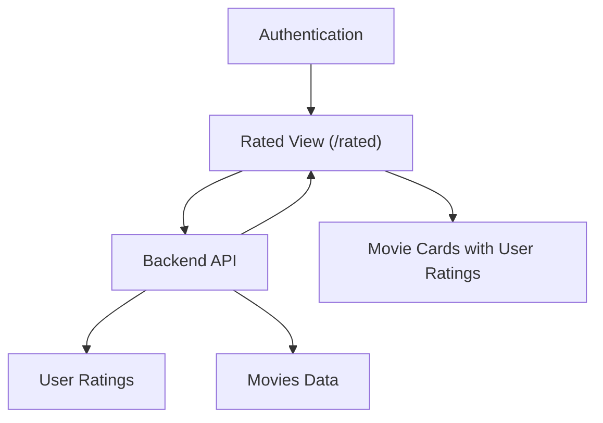
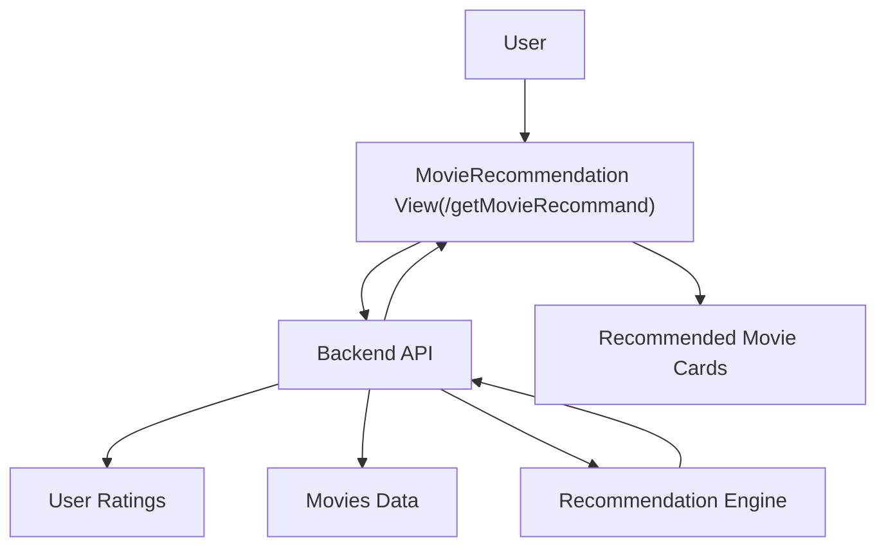

# Features

> **Relevant source files**
> * [MovieRecomandAPP/src/components/MovieCard.vue](https://github.com/zsqgleRoy/MoviesRecommand/blob/49b41f2a/MovieRecomandAPP/src/components/MovieCard.vue)
> * [MovieRecomandAPP/src/components/SearchBar.vue](https://github.com/zsqgleRoy/MoviesRecommand/blob/49b41f2a/MovieRecomandAPP/src/components/SearchBar.vue)
> * [MovieRecomandAPP/src/router/index.ts](https://github.com/zsqgleRoy/MoviesRecommand/blob/49b41f2a/MovieRecomandAPP/src/router/index.ts)

This document provides a comprehensive overview of the main functionalities available in the MoviesRecommand system. It covers user-focused features including movie browsing, search capabilities, user authentication, rating system, and the recommendation engine. For information about the overall system architecture, see [System Architecture](/zsqgleRoy/MoviesRecommand/1.1-system-architecture).

## Feature Overview

The MoviesRecommand system offers several core features that work together to provide a comprehensive movie exploration and recommendation experience.

Sources: [MovieRecomandAPP/src/router/index.ts](https://github.com/zsqgleRoy/MoviesRecommand/blob/49b41f2a/MovieRecomandAPP/src/router/index.ts)

 [MovieRecomandAPP/src/components/MovieCard.vue](https://github.com/zsqgleRoy/MoviesRecommand/blob/49b41f2a/MovieRecomandAPP/src/components/MovieCard.vue)

## User Authentication

Authentication is a fundamental feature that enables personalized experiences in the system. Users must be authenticated to rate movies and receive personalized recommendations.

The system routes unauthenticated users to the login/registration page when attempting to access features that require authentication. This is implemented in the `MovieCard.vue` component's rating functionality.

Sources: [MovieRecomandAPP/src/router/index.ts L13-L17](https://github.com/zsqgleRoy/MoviesRecommand/blob/49b41f2a/MovieRecomandAPP/src/router/index.ts#L13-L17)

 [MovieRecomandAPP/src/components/MovieCard.vue L91-L97](https://github.com/zsqgleRoy/MoviesRecommand/blob/49b41f2a/MovieRecomandAPP/src/components/MovieCard.vue#L91-L97)

 [MovieRecomandAPP/src/components/MovieCard.vue L128-L152](https://github.com/zsqgleRoy/MoviesRecommand/blob/49b41f2a/MovieRecomandAPP/src/components/MovieCard.vue#L128-L152)

## Movie Browsing and Discovery

### Movie Card Interface

The primary interface for browsing movies is the `MovieCard` component, which presents movie information in an interactive card format.

Each movie card displays:

* Movie poster
* Title
* Release year
* Average rating (if available)
* Genre tags
* User rating interface (when hovering)

The cards feature a hover interaction that expands the card and reveals additional information and controls.

Sources: [MovieRecomandAPP/src/components/MovieCard.vue L1-L62](https://github.com/zsqgleRoy/MoviesRecommand/blob/49b41f2a/MovieRecomandAPP/src/components/MovieCard.vue#L1-L62)

 [MovieRecomandAPP/src/components/MovieCard.vue L156-L344](https://github.com/zsqgleRoy/MoviesRecommand/blob/49b41f2a/MovieRecomandAPP/src/components/MovieCard.vue#L156-L344)

### Search Functionality

The search feature enables users to find specific movies by keywords through the `SearchBar` component.

The search process:

1. User enters keywords in the search input field
2. On submission (button click or Enter key), the `performSearch` function is called
3. The router navigates to the `/search` route with the query as a parameter
4. The SearchResults component displays movies that match the search criteria

Sources: [MovieRecomandAPP/src/components/SearchBar.vue L1-L59](https://github.com/zsqgleRoy/MoviesRecommand/blob/49b41f2a/MovieRecomandAPP/src/components/SearchBar.vue#L1-L59)

 [MovieRecomandAPP/src/router/index.ts L73-L78](https://github.com/zsqgleRoy/MoviesRecommand/blob/49b41f2a/MovieRecomandAPP/src/router/index.ts#L73-L78)

### Movie Details

Users can access detailed information about a specific movie through dedicated movie detail pages.

| Route | Component | Description |
| --- | --- | --- |
| `/movie/:id` | MovieDetail.vue | Displays comprehensive information about a specific movie |

The movie detail view is accessible by clicking on movie cards or search results, providing in-depth information beyond what's shown in the card view.

Sources: [MovieRecomandAPP/src/router/index.ts L38-L42](https://github.com/zsqgleRoy/MoviesRecommand/blob/49b41f2a/MovieRecomandAPP/src/router/index.ts#L38-L42)

## Movie Rating System

The rating system is a core feature that allows users to rate movies on a scale of 1-10. These ratings serve as the foundation for the recommendation engine.

The rating implementation includes:

1. **Rating Interface**: An interactive star rating component allowing users to select values from 1-10
2. **Authentication Check**: Verifies the user is logged in before accepting ratings
3. **Rating Submission**: Sends the rating data to the backend API
4. **User Feedback**: Provides confirmation when a rating is successfully submitted

The system stores ratings with the following data:

* User ID
* Movie ID
* Rating value (1-10)
* Timestamp

Sources: [MovieRecomandAPP/src/components/MovieCard.vue L38-L59](https://github.com/zsqgleRoy/MoviesRecommand/blob/49b41f2a/MovieRecomandAPP/src/components/MovieCard.vue#L38-L59)

 [MovieRecomandAPP/src/components/MovieCard.vue L91-L125](https://github.com/zsqgleRoy/MoviesRecommand/blob/49b41f2a/MovieRecomandAPP/src/components/MovieCard.vue#L91-L125)

## Rated Movies View

Users can access their previously rated movies through a dedicated "Rated Movies" page.

This feature allows users to:

* Review their rating history
* Adjust previous ratings if desired
* Access movies they've already rated

Sources: [MovieRecomandAPP/src/router/index.ts L33-L37](https://github.com/zsqgleRoy/MoviesRecommand/blob/49b41f2a/MovieRecomandAPP/src/router/index.ts#L33-L37)

## Recommendation Engine

The recommendation system analyzes user ratings to suggest personalized movie recommendations.

The recommendation system works by:

1. Collecting user ratings
2. Analyzing rating patterns
3. Identifying movies with similar characteristics to highly-rated movies
4. Presenting personalized movie recommendations

Users access recommendations through the dedicated recommendation page, which is implemented as the `GETRecommand` component in the router.

Sources: [MovieRecomandAPP/src/router/index.ts L63-L67](https://github.com/zsqgleRoy/MoviesRecommand/blob/49b41f2a/MovieRecomandAPP/src/router/index.ts#L63-L67)

## Feature Navigation

The application provides navigation to all major features through the router system:

| Route | Component | Feature |
| --- | --- | --- |
| `/` | HomeView | Movie browsing home page |
| `/LoginRegister` | LoginRegister.vue | User authentication |
| `/dafen` | DaFen.vue | Rating interface |
| `/rated` | rated.vue | View rated movies |
| `/movie/:id` | MovieDetail.vue | Movie details |
| `/getMovieRecommand` | GETRecommand | Movie recommendations |
| `/search` | SearchResults.vue | Search results |

Sources: [MovieRecomandAPP/src/router/index.ts L5-L80](https://github.com/zsqgleRoy/MoviesRecommand/blob/49b41f2a/MovieRecomandAPP/src/router/index.ts#L5-L80)