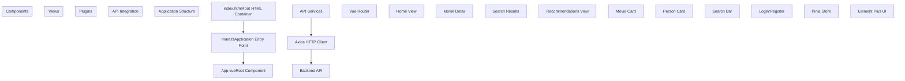
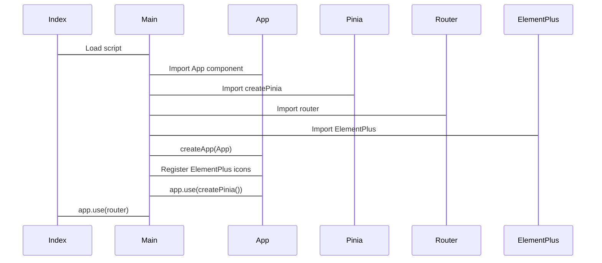
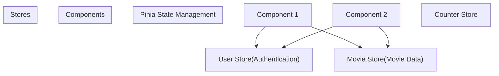
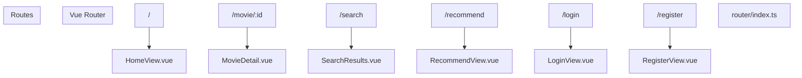
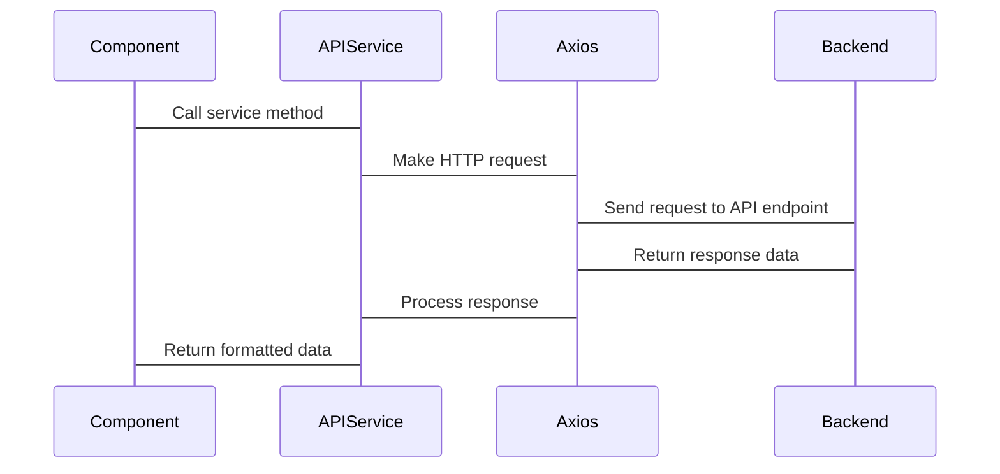
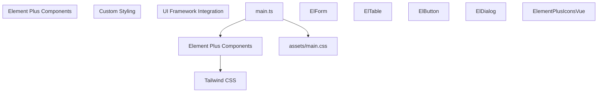
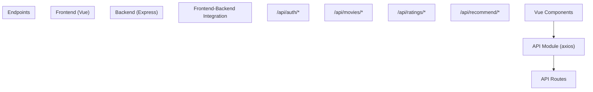

# Frontend Application

> **Relevant source files**
> * [MovieRecomandAPP/README.md](https://github.com/zsqgleRoy/MoviesRecommand/blob/49b41f2a/MovieRecomandAPP/README.md)
> * [MovieRecomandAPP/index.html](https://github.com/zsqgleRoy/MoviesRecommand/blob/49b41f2a/MovieRecomandAPP/index.html)
> * [MovieRecomandAPP/package.json](https://github.com/zsqgleRoy/MoviesRecommand/blob/49b41f2a/MovieRecomandAPP/package.json)
> * [MovieRecomandAPP/src/main.ts](https://github.com/zsqgleRoy/MoviesRecommand/blob/49b41f2a/MovieRecomandAPP/src/main.ts)

## Purpose and Scope

This document covers the frontend application of the MovieRecommand system, which is a Vue 3-based web application that provides the user interface for the movie recommendation platform. The frontend handles user authentication, movie browsing, rating, and displaying personalized recommendations.

For information about database structure, refer to [Database](/zsqgleRoy/MoviesRecommand/2-database).
For details on specific features like authentication and recommendation algorithms, see [Features](/zsqgleRoy/MoviesRecommand/4-features).

## Technology Stack

The MovieRecommand frontend application is built using the following technologies:

| Technology | Purpose | Version |
| --- | --- | --- |
| Vue.js | Frontend framework | 3.5.13 |
| Vite | Build tool | 6.2.4 |
| TypeScript | Type checking | 5.8.0 |
| Pinia | State management | 3.0.1 |
| Vue Router | Navigation | 4.5.1 |
| Element Plus | UI component library | 2.9.9 |
| Axios | HTTP client | 1.9.0 |
| Tailwind CSS | Styling | 4.1.4 |

Sources: [MovieRecomandAPP/package.json L1-L41](https://github.com/zsqgleRoy/MoviesRecommand/blob/49b41f2a/MovieRecomandAPP/package.json#L1-L41)

## Application Structure



Sources: [MovieRecomandAPP/index.html L1-L14](https://github.com/zsqgleRoy/MoviesRecommand/blob/49b41f2a/MovieRecomandAPP/index.html#L1-L14)

 [MovieRecomandAPP/src/main.ts L1-L18](https://github.com/zsqgleRoy/MoviesRecommand/blob/49b41f2a/MovieRecomandAPP/src/main.ts#L1-L18)

### Entry Point and Initialization

The application's entry point is `main.ts`, which:

1. Imports and registers all required dependencies
2. Creates the Vue application instance
3. Registers Element Plus icons
4. Sets up Pinia for state management
5. Configures Vue Router for navigation
6. Mounts the app to the DOM element with id "app"



Sources: [MovieRecomandAPP/src/main.ts L1-L18](https://github.com/zsqgleRoy/MoviesRecommand/blob/49b41f2a/MovieRecomandAPP/src/main.ts#L1-L18)

 [MovieRecomandAPP/index.html L1-L14](https://github.com/zsqgleRoy/MoviesRecommand/blob/49b41f2a/MovieRecomandAPP/index.html#L1-L14)

### Component Architecture

The application follows a standard Vue 3 component architecture:

* **App.vue**: The root component that typically includes the main layout and navigation
* **Views**: Page-level components rendered by the router
* **Components**: Reusable UI elements used across different views

Components use Composition API style with script setup for better TypeScript integration and improved code organization.

## State Management

The application uses Pinia for state management, which is the official state management solution for Vue 3 applications.



Sources: [MovieRecomandAPP/src/main.ts L4-L14](https://github.com/zsqgleRoy/MoviesRecommand/blob/49b41f2a/MovieRecomandAPP/src/main.ts#L4-L14)

 [MovieRecomandAPP/package.json L23-L24](https://github.com/zsqgleRoy/MoviesRecommand/blob/49b41f2a/MovieRecomandAPP/package.json#L23-L24)

## Routing

The application uses Vue Router for navigation between different views:



Sources: [MovieRecomandAPP/src/main.ts L8-L15](https://github.com/zsqgleRoy/MoviesRecommand/blob/49b41f2a/MovieRecomandAPP/src/main.ts#L8-L15)

 [MovieRecomandAPP/package.json

26](https://github.com/zsqgleRoy/MoviesRecommand/blob/49b41f2a/MovieRecomandAPP/package.json#L26-L26)

## API Integration

The frontend communicates with the backend API using Axios:



Sources: [MovieRecomandAPP/package.json

16](https://github.com/zsqgleRoy/MoviesRecommand/blob/49b41f2a/MovieRecomandAPP/package.json#L16-L16)

## UI Framework

The application uses Element Plus for UI components with Tailwind CSS for styling:



Sources: [MovieRecomandAPP/src/main.ts L1-L17](https://github.com/zsqgleRoy/MoviesRecommand/blob/49b41f2a/MovieRecomandAPP/src/main.ts#L1-L17)

 [MovieRecomandAPP/package.json L14-L24](https://github.com/zsqgleRoy/MoviesRecommand/blob/49b41f2a/MovieRecomandAPP/package.json#L14-L24)

## Development Setup

To set up the frontend application for development:

1. Install dependencies:

```
npm install
```

1. Start the development server:

```
npm run dev
```

1. Build for production:

```
npm run build
```

The development server provides hot-module replacement for quick iteration during development.

Sources: [MovieRecomandAPP/README.md L17-L33](https://github.com/zsqgleRoy/MoviesRecommand/blob/49b41f2a/MovieRecomandAPP/README.md#L17-L33)

## Integration with Backend

The frontend application communicates with the backend server through RESTful API endpoints:



Sources: [MovieRecomandAPP/package.json L16-L22](https://github.com/zsqgleRoy/MoviesRecommand/blob/49b41f2a/MovieRecomandAPP/package.json#L16-L22)

## Conclusion

The MovieRecommand frontend application provides a responsive user interface for interacting with the movie recommendation system. Built with modern JavaScript/TypeScript technologies, it offers a component-based architecture that enables maintainable and scalable development.

For information on how to use specific features of the application, refer to [Features](/zsqgleRoy/MoviesRecommand/4-features).