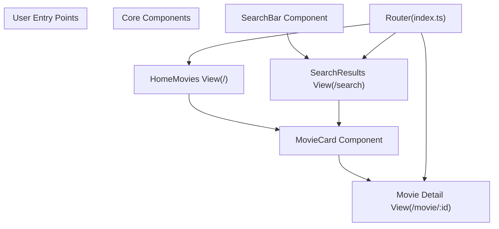
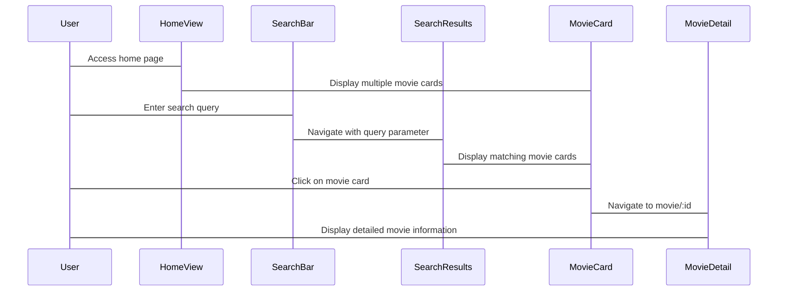
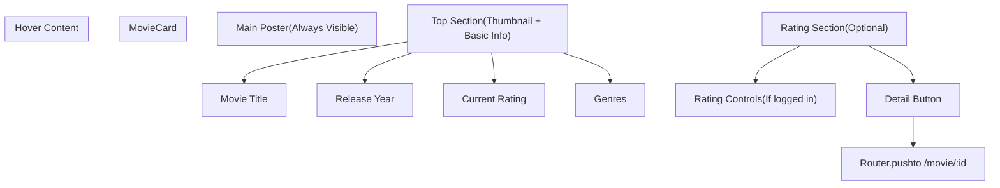
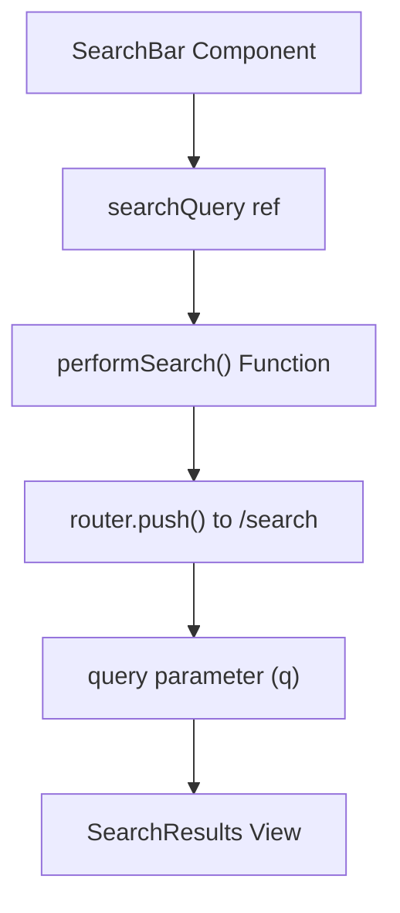
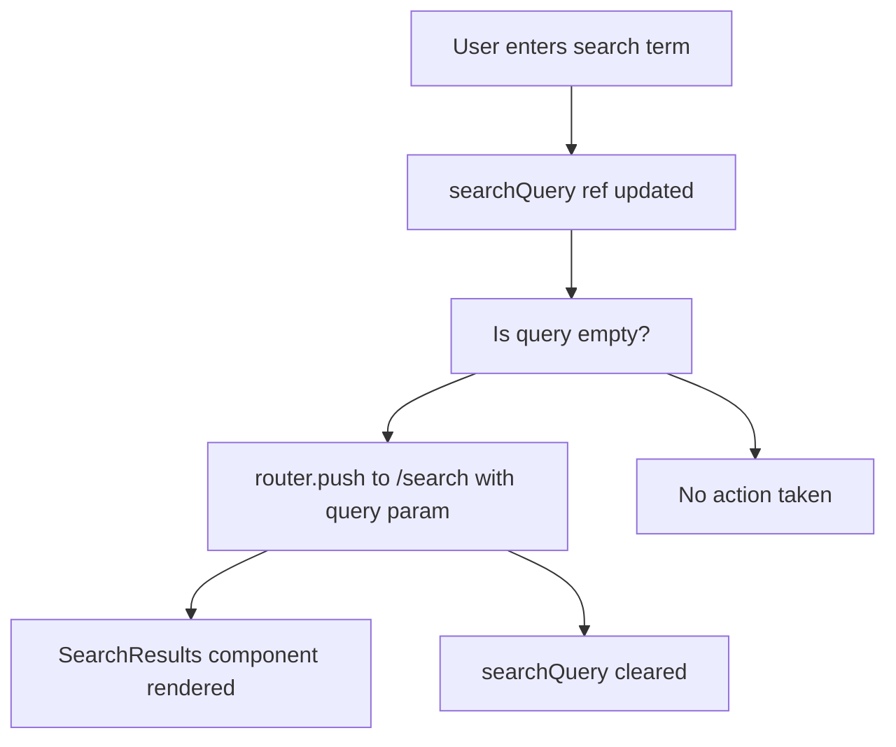

# Movie Browsing

> **Relevant source files**
> * [MovieRecomandAPP/src/components/MovieCard.vue](https://github.com/zsqgleRoy/MoviesRecommand/blob/49b41f2a/MovieRecomandAPP/src/components/MovieCard.vue)
> * [MovieRecomandAPP/src/components/SearchBar.vue](https://github.com/zsqgleRoy/MoviesRecommand/blob/49b41f2a/MovieRecomandAPP/src/components/SearchBar.vue)
> * [MovieRecomandAPP/src/router/index.ts](https://github.com/zsqgleRoy/MoviesRecommand/blob/49b41f2a/MovieRecomandAPP/src/router/index.ts)

## Overview

This document provides technical documentation for the Movie Browsing functionality within the Movie Recommendation system. Movie Browsing encompasses the features that allow users to discover and interact with movies in the application, including viewing movie listings, searching for specific movies, and accessing detailed movie information.

For information about rating movies after browsing, see [Movie Rating](/zsqgleRoy/MoviesRecommand/4.3-movie-rating).
For personalized movie recommendations, see [Recommendations](/zsqgleRoy/MoviesRecommand/4.4-recommendations).

## Movie Browsing Architecture

The Movie Browsing functionality is implemented through a combination of Vue components and router configurations that facilitate navigation between different views.



Sources: [MovieRecomandAPP/src/components/MovieCard.vue L1-L344](https://github.com/zsqgleRoy/MoviesRecommand/blob/49b41f2a/MovieRecomandAPP/src/components/MovieCard.vue#L1-L344)

 [MovieRecomandAPP/src/components/SearchBar.vue L1-L59](https://github.com/zsqgleRoy/MoviesRecommand/blob/49b41f2a/MovieRecomandAPP/src/components/SearchBar.vue#L1-L59)

 [MovieRecomandAPP/src/router/index.ts L1-L83](https://github.com/zsqgleRoy/MoviesRecommand/blob/49b41f2a/MovieRecomandAPP/src/router/index.ts#L1-L83)

## Navigation Flow

The following sequence diagram illustrates how users navigate through the Movie Browsing system:



Sources: [MovieRecomandAPP/src/components/SearchBar.vue L10-L20](https://github.com/zsqgleRoy/MoviesRecommand/blob/49b41f2a/MovieRecomandAPP/src/components/SearchBar.vue#L10-L20)

 [MovieRecomandAPP/src/components/MovieCard.vue L122-L124](https://github.com/zsqgleRoy/MoviesRecommand/blob/49b41f2a/MovieRecomandAPP/src/components/MovieCard.vue#L122-L124)

 [MovieRecomandAPP/src/router/index.ts L37-L42](https://github.com/zsqgleRoy/MoviesRecommand/blob/49b41f2a/MovieRecomandAPP/src/router/index.ts#L37-L42)

## Key Components

### Movie Card Component

The `MovieCard` component is the primary element for displaying movie information in a browseable format.

#### Key Features:

1. **Display Format**: Presents movie information in a card layout with poster image and basic details
2. **Hover Interaction**: Expands with additional information when hovered
3. **Rating Capability**: Includes UI for users to rate movies (see [Movie Rating](/zsqgleRoy/MoviesRecommand/4.3-movie-rating))
4. **Navigation**: Clicking on a card navigates to the movie's detail page

#### Component Structure:



Sources: [MovieRecomandAPP/src/components/MovieCard.vue L1-L61](https://github.com/zsqgleRoy/MoviesRecommand/blob/49b41f2a/MovieRecomandAPP/src/components/MovieCard.vue#L1-L61)

 [MovieRecomandAPP/src/components/MovieCard.vue L122-L124](https://github.com/zsqgleRoy/MoviesRecommand/blob/49b41f2a/MovieRecomandAPP/src/components/MovieCard.vue#L122-L124)

### Search Bar Component

The `SearchBar` component provides the functionality to search for movies throughout the application.

#### Implementation Details:

1. **Input Handling**: Captures user input in the search field
2. **Query Processing**: Trims and validates the search query
3. **Navigation**: Routes to the search results page with the query as a parameter
4. **UI Integration**: Uses Element Plus components for consistent styling



Sources: [MovieRecomandAPP/src/components/SearchBar.vue L1-L59](https://github.com/zsqgleRoy/MoviesRecommand/blob/49b41f2a/MovieRecomandAPP/src/components/SearchBar.vue#L1-L59)

 [MovieRecomandAPP/src/router/index.ts L73-L78](https://github.com/zsqgleRoy/MoviesRecommand/blob/49b41f2a/MovieRecomandAPP/src/router/index.ts#L73-L78)

## Route Configuration

The application's router configuration defines several paths relevant to movie browsing:

| Route Path | Component | Description |
| --- | --- | --- |
| `/` | `HomeView` | Main movie browsing page |
| `/search` | `SearchResults` | Displays search results with query parameter |
| `/movie/:id` | `MovieDetail` | Shows detailed information for a specific movie |
| `/getMovieRecommand` | `GETRecommand` | Displays personalized movie recommendations |

Sources: [MovieRecomandAPP/src/router/index.ts L5-L78](https://github.com/zsqgleRoy/MoviesRecommand/blob/49b41f2a/MovieRecomandAPP/src/router/index.ts#L5-L78)

## MovieCard Component Technical Details

The `MovieCard` component has two main sections:

1. **Main Poster**: The default view showing just the movie poster
2. **Hover Content**: An expanded view with additional information and interactive elements

### Props and Data Flow

The component accepts a `movie` prop with the following structure:

```
interface Movie {
  id: number
  title: string
  poster: string
  genres: string
  year: number
  rating: number
  userRating?: number
}
```

### User Interaction Flow

When a user interacts with a movie card:

1. If the user hovers over the card, it expands to show additional information
2. If the user clicks the card (and hasn't rated it), they are navigated to the movie detail page
3. If the user sets a rating, they can submit it directly from the card

Sources: [MovieRecomandAPP/src/components/MovieCard.vue L64-L153](https://github.com/zsqgleRoy/MoviesRecommand/blob/49b41f2a/MovieRecomandAPP/src/components/MovieCard.vue#L64-L153)

## Search Implementation

The search functionality follows this implementation flow:

1. User enters a search term in the `SearchBar` component
2. The component captures the input and validates it upon submission
3. The router navigates to the `/search` route with the query as a URL parameter
4. The `SearchResults` component receives the query parameter and displays matching movies

The search functionality is implemented via the `performSearch` method in `SearchBar.vue`:



Sources: [MovieRecomandAPP/src/components/SearchBar.vue L9-L20](https://github.com/zsqgleRoy/MoviesRecommand/blob/49b41f2a/MovieRecomandAPP/src/components/SearchBar.vue#L9-L20)

 [MovieRecomandAPP/src/router/index.ts L73-L78](https://github.com/zsqgleRoy/MoviesRecommand/blob/49b41f2a/MovieRecomandAPP/src/router/index.ts#L73-L78)

## Responsive Design Considerations

The movie browsing interface is designed to be responsive across different devices:

1. **Desktop View**:

* Movie cards expand on hover
* Full hover content is displayed
2. **Mobile View**:

* Cards maintain fixed width relative to screen
* Hover effects are disabled
* Basic information is always visible

The responsive behavior is primarily controlled through media queries in the `MovieCard` component:

Sources: [MovieRecomandAPP/src/components/MovieCard.vue L320-L343](https://github.com/zsqgleRoy/MoviesRecommand/blob/49b41f2a/MovieRecomandAPP/src/components/MovieCard.vue#L320-L343)

## Integration with Other Features

Movie Browsing serves as an entry point to other key features of the application:

1. **Movie Detail View**: Accessed by clicking on a movie card
2. **Movie Rating**: Can be performed directly from the movie card or detail page
3. **Movie Recommendations**: Based on browsing and rating history

For information about the relationship between browsing and personalized recommendations, refer to [Recommendations](/zsqgleRoy/MoviesRecommand/4.4-recommendations).

Sources: [MovieRecomandAPP/src/components/MovieCard.vue L99-L125](https://github.com/zsqgleRoy/MoviesRecommand/blob/49b41f2a/MovieRecomandAPP/src/components/MovieCard.vue#L99-L125)

 [MovieRecomandAPP/src/router/index.ts L63-L67](https://github.com/zsqgleRoy/MoviesRecommand/blob/49b41f2a/MovieRecomandAPP/src/router/index.ts#L63-L67)

## Summary

The Movie Browsing system provides a cohesive and intuitive interface for users to discover and interact with movies. It is implemented through a combination of Vue components and router configurations that enable seamless navigation between different views and features of the application.

The key components (`MovieCard` and `SearchBar`) work together to provide a comprehensive browsing experience, allowing users to view movie listings, search for specific movies, and access detailed information.