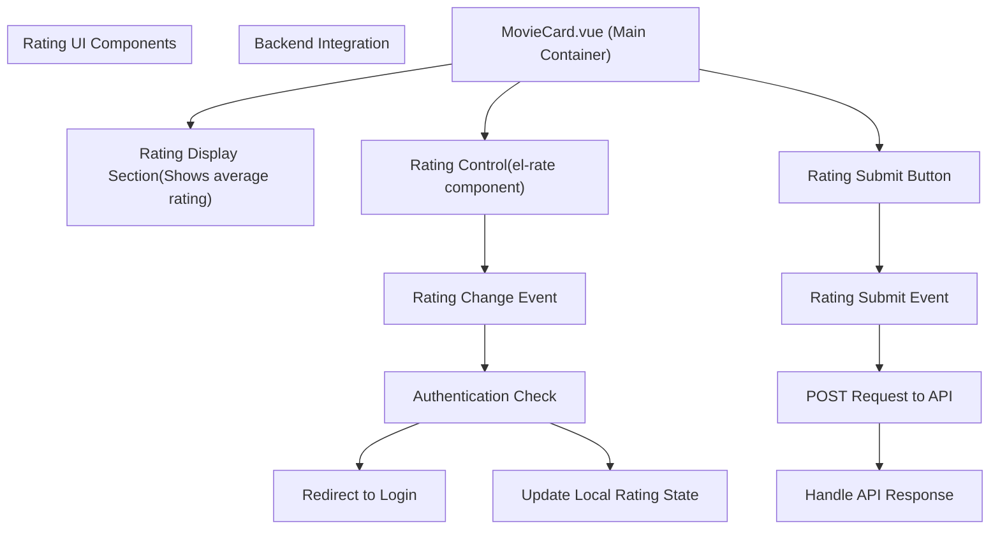
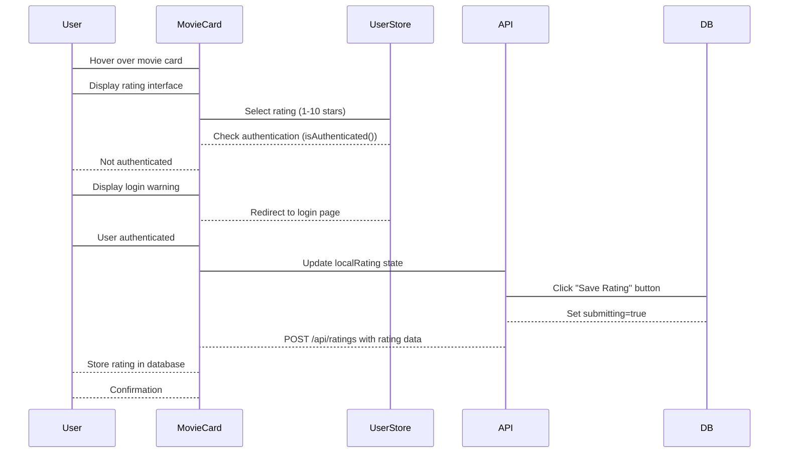

# Movie Rating

> **Relevant source files**
> * [MovieRecomandAPP/src/components/MovieCard.vue](https://github.com/zsqgleRoy/MoviesRecommand/blob/49b41f2a/MovieRecomandAPP/src/components/MovieCard.vue)

## Purpose and Scope

This document details the Movie Rating feature in the MoviesRecommand system, which allows authenticated users to rate movies on a scale of 0-10. The rating system serves as a critical data collection mechanism for the recommendation engine and provides users with a way to track their movie preferences. For information about how these ratings are used to generate recommendations, see [Recommendations](/zsqgleRoy/MoviesRecommand/4.4-recommendations).

## Overview

The Movie Rating feature enables users to:

1. View existing average ratings for movies
2. Submit personal ratings for movies they've watched
3. Update their previous ratings
4. Have their ratings saved to the database for recommendation processing

Sources: [MovieRecomandAPP/src/components/MovieCard.vue L38-L59](https://github.com/zsqgleRoy/MoviesRecommand/blob/49b41f2a/MovieRecomandAPP/src/components/MovieCard.vue#L38-L59)

## Rating User Interface

The rating functionality is primarily implemented within the MovieCard component, which displays movie information along with an interactive rating control.



The rating UI appears when users hover over a movie card, displaying:

* A star-based rating component (1-10 stars with half-star precision)
* The current user's rating (if previously rated)
* A submit button that adapts its text based on the current rating state

Sources: [MovieRecomandAPP/src/components/MovieCard.vue L38-L59](https://github.com/zsqgleRoy/MoviesRecommand/blob/49b41f2a/MovieRecomandAPP/src/components/MovieCard.vue#L38-L59)

 [MovieRecomandAPP/src/components/MovieCard.vue L156-L318](https://github.com/zsqgleRoy/MoviesRecommand/blob/49b41f2a/MovieRecomandAPP/src/components/MovieCard.vue#L156-L318)

## Rating Component Implementation

The movie rating implementation consists of two main parts:

1. **UI Components**: The star rating visual interface using Element Plus
2. **Rating Logic**: JavaScript functions that handle rating state and submission



Sources: [MovieRecomandAPP/src/components/MovieCard.vue L64-L154](https://github.com/zsqgleRoy/MoviesRecommand/blob/49b41f2a/MovieRecomandAPP/src/components/MovieCard.vue#L64-L154)

## Rating Data Flow

When a user submits a rating, the following data is sent to the backend API:

| Field | Description | Source |
| --- | --- | --- |
| `userId` | Identifier for the current user | Extracted from user store |
| `movieId` | Identifier for the rated movie | From movie prop |
| `rating` | Numeric rating value (0-10) | From user input |
| `timestamp` | Date/time when rating was submitted | Generated at submission time |

Sources: [MovieRecomandAPP/src/components/MovieCard.vue L104-L108](https://github.com/zsqgleRoy/MoviesRecommand/blob/49b41f2a/MovieRecomandAPP/src/components/MovieCard.vue#L104-L108)

## Code Implementation Details

### Rating State Management

The component maintains local state for the rating using Vue's reactive system:

```
// Initial rating value - either from existing user rating or 0
const localRating = ref(props.movie.userRating || 0)
```

This allows the component to track the user's rating before it's submitted to the backend.

Sources: [MovieRecomandAPP/src/components/MovieCard.vue

87](https://github.com/zsqgleRoy/MoviesRecommand/blob/49b41f2a/MovieRecomandAPP/src/components/MovieCard.vue#L87-L87)

### Authentication Check

Before allowing a user to rate a movie, the system verifies authentication status:

```
// Rating change handler
const handleRatingChange = (value: number) => {
  if (!isAuthenticated()) {
    ElMessage.warning('请先登录后再进行评分')
    return router.push('/LoginRegister')
  }
  localRating.value = value
}
```

This function redirects unauthenticated users to the login page while storing the rating value for authenticated users.

Sources: [MovieRecomandAPP/src/components/MovieCard.vue L91-L97](https://github.com/zsqgleRoy/MoviesRecommand/blob/49b41f2a/MovieRecomandAPP/src/components/MovieCard.vue#L91-L97)

### Rating Submission

The rating submission process sends the data to the backend API:

```
const submitRating = async () => {
  if(localRating.value > 0){
    try {
      submitting.value = true
      const response = await axios.post('http://localhost:8080/api/ratings', {
        userId: userId.value,
        movieId: props.movie.id,
        rating: localRating.value,
        timestamp: new Date().toISOString()
      })

      if (response.data.code === 200) {
        ElMessage.success('评分提交成功')
        props.movie.userRating = localRating.value
      }
    } catch (err) {
      ElMessage.error('评分提交失败')
      console.error('评分提交错误:', err)
    } finally {
      submitting.value = false
    }
  }
  else{
    router.push(`/movie/${props.movie.id}`)
  }
}
```

This function handles the entire submission lifecycle, including loading states, error handling, and success feedback.

Sources: [MovieRecomandAPP/src/components/MovieCard.vue L99-L125](https://github.com/zsqgleRoy/MoviesRecommand/blob/49b41f2a/MovieRecomandAPP/src/components/MovieCard.vue#L99-L125)

## User Experience Flow

```
#mermaid-s9wc5ieak3{font-family:ui-sans-serif,-apple-system,system-ui,Segoe UI,Helvetica;font-size:16px;fill:#333;}@keyframes edge-animation-frame{from{stroke-dashoffset:0;}}@keyframes dash{to{stroke-dashoffset:0;}}#mermaid-s9wc5ieak3 .edge-animation-slow{stroke-dasharray:9,5!important;stroke-dashoffset:900;animation:dash 50s linear infinite;stroke-linecap:round;}#mermaid-s9wc5ieak3 .edge-animation-fast{stroke-dasharray:9,5!important;stroke-dashoffset:900;animation:dash 20s linear infinite;stroke-linecap:round;}#mermaid-s9wc5ieak3 .error-icon{fill:#dddddd;}#mermaid-s9wc5ieak3 .error-text{fill:#222222;stroke:#222222;}#mermaid-s9wc5ieak3 .edge-thickness-normal{stroke-width:1px;}#mermaid-s9wc5ieak3 .edge-thickness-thick{stroke-width:3.5px;}#mermaid-s9wc5ieak3 .edge-pattern-solid{stroke-dasharray:0;}#mermaid-s9wc5ieak3 .edge-thickness-invisible{stroke-width:0;fill:none;}#mermaid-s9wc5ieak3 .edge-pattern-dashed{stroke-dasharray:3;}#mermaid-s9wc5ieak3 .edge-pattern-dotted{stroke-dasharray:2;}#mermaid-s9wc5ieak3 .marker{fill:#999;stroke:#999;}#mermaid-s9wc5ieak3 .marker.cross{stroke:#999;}#mermaid-s9wc5ieak3 svg{font-family:ui-sans-serif,-apple-system,system-ui,Segoe UI,Helvetica;font-size:16px;}#mermaid-s9wc5ieak3 p{margin:0;}#mermaid-s9wc5ieak3 defs #statediagram-barbEnd{fill:#999;stroke:#999;}#mermaid-s9wc5ieak3 g.stateGroup text{fill:#dddddd;stroke:none;font-size:10px;}#mermaid-s9wc5ieak3 g.stateGroup text{fill:#333;stroke:none;font-size:10px;}#mermaid-s9wc5ieak3 g.stateGroup .state-title{font-weight:bolder;fill:#333;}#mermaid-s9wc5ieak3 g.stateGroup rect{fill:#ffffff;stroke:#dddddd;}#mermaid-s9wc5ieak3 g.stateGroup line{stroke:#999;stroke-width:1;}#mermaid-s9wc5ieak3 .transition{stroke:#999;stroke-width:1;fill:none;}#mermaid-s9wc5ieak3 .stateGroup .composit{fill:#f4f4f4;border-bottom:1px;}#mermaid-s9wc5ieak3 .stateGroup .alt-composit{fill:#e0e0e0;border-bottom:1px;}#mermaid-s9wc5ieak3 .state-note{stroke:#e6d280;fill:#fff5ad;}#mermaid-s9wc5ieak3 .state-note text{fill:#333;stroke:none;font-size:10px;}#mermaid-s9wc5ieak3 .stateLabel .box{stroke:none;stroke-width:0;fill:#ffffff;opacity:0.5;}#mermaid-s9wc5ieak3 .edgeLabel .label rect{fill:#ffffff;opacity:0.5;}#mermaid-s9wc5ieak3 .edgeLabel{background-color:#ffffff;text-align:center;}#mermaid-s9wc5ieak3 .edgeLabel p{background-color:#ffffff;}#mermaid-s9wc5ieak3 .edgeLabel rect{opacity:0.5;background-color:#ffffff;fill:#ffffff;}#mermaid-s9wc5ieak3 .edgeLabel .label text{fill:#333;}#mermaid-s9wc5ieak3 .label div .edgeLabel{color:#333;}#mermaid-s9wc5ieak3 .stateLabel text{fill:#333;font-size:10px;font-weight:bold;}#mermaid-s9wc5ieak3 .node circle.state-start{fill:#999;stroke:#999;}#mermaid-s9wc5ieak3 .node .fork-join{fill:#999;stroke:#999;}#mermaid-s9wc5ieak3 .node circle.state-end{fill:#dddddd;stroke:#f4f4f4;stroke-width:1.5;}#mermaid-s9wc5ieak3 .end-state-inner{fill:#f4f4f4;stroke-width:1.5;}#mermaid-s9wc5ieak3 .node rect{fill:#ffffff;stroke:#dddddd;stroke-width:1px;}#mermaid-s9wc5ieak3 .node polygon{fill:#ffffff;stroke:#dddddd;stroke-width:1px;}#mermaid-s9wc5ieak3 #statediagram-barbEnd{fill:#999;}#mermaid-s9wc5ieak3 .statediagram-cluster rect{fill:#ffffff;stroke:#dddddd;stroke-width:1px;}#mermaid-s9wc5ieak3 .cluster-label,#mermaid-s9wc5ieak3 .nodeLabel{color:#333;}#mermaid-s9wc5ieak3 .statediagram-cluster rect.outer{rx:5px;ry:5px;}#mermaid-s9wc5ieak3 .statediagram-state .divider{stroke:#dddddd;}#mermaid-s9wc5ieak3 .statediagram-state .title-state{rx:5px;ry:5px;}#mermaid-s9wc5ieak3 .statediagram-cluster.statediagram-cluster .inner{fill:#f4f4f4;}#mermaid-s9wc5ieak3 .statediagram-cluster.statediagram-cluster-alt .inner{fill:#f8f8f8;}#mermaid-s9wc5ieak3 .statediagram-cluster .inner{rx:0;ry:0;}#mermaid-s9wc5ieak3 .statediagram-state rect.basic{rx:5px;ry:5px;}#mermaid-s9wc5ieak3 .statediagram-state rect.divider{stroke-dasharray:10,10;fill:#f8f8f8;}#mermaid-s9wc5ieak3 .note-edge{stroke-dasharray:5;}#mermaid-s9wc5ieak3 .statediagram-note rect{fill:#fff5ad;stroke:#e6d280;stroke-width:1px;rx:0;ry:0;}#mermaid-s9wc5ieak3 .statediagram-note rect{fill:#fff5ad;stroke:#e6d280;stroke-width:1px;rx:0;ry:0;}#mermaid-s9wc5ieak3 .statediagram-note text{fill:#333;}#mermaid-s9wc5ieak3 .statediagram-note .nodeLabel{color:#333;}#mermaid-s9wc5ieak3 .statediagram .edgeLabel{color:red;}#mermaid-s9wc5ieak3 #dependencyStart,#mermaid-s9wc5ieak3 #dependencyEnd{fill:#999;stroke:#999;stroke-width:1;}#mermaid-s9wc5ieak3 .statediagramTitleText{text-anchor:middle;font-size:18px;fill:#333;}#mermaid-s9wc5ieak3 :root{--mermaid-font-family:"trebuchet ms",verdana,arial,sans-serif;}Submission ProcessMouse hover over cardClick/tap rating starsNot authenticatedAfter successful loginAuthenticatedClick "Save Rating"API returns 200API errorTry againCompleteViewMovieHoverCardSelectRatingAuthentication CheckLoginRatingSelectedSubmitRatingSubmittingSuccessFailure
```

Sources: [MovieRecomandAPP/src/components/MovieCard.vue L38-L59](https://github.com/zsqgleRoy/MoviesRecommand/blob/49b41f2a/MovieRecomandAPP/src/components/MovieCard.vue#L38-L59)

 [MovieRecomandAPP/src/components/MovieCard.vue L91-L125](https://github.com/zsqgleRoy/MoviesRecommand/blob/49b41f2a/MovieRecomandAPP/src/components/MovieCard.vue#L91-L125)

## Technical Integration with Database

While the frontend code doesn't directly interact with the database, the rating data submitted through the API is stored in the database's Ratings table. This table establishes relationships between:

1. Users (who submitted the rating)
2. Movies (that were rated)
3. Rating values (the numerical score)
4. Timestamps (when the rating occurred)

This data structure enables:

* Movie listing with average ratings
* Personalized views with user's own ratings
* Historical rating data for analysis
* Input for the recommendation engine

Sources: [MovieRecomandAPP/src/components/MovieCard.vue L104-L108](https://github.com/zsqgleRoy/MoviesRecommand/blob/49b41f2a/MovieRecomandAPP/src/components/MovieCard.vue#L104-L108)

## Error Handling and Edge Cases

The rating system handles several error and edge cases:

1. **User not logged in**: Redirects to login page with a warning message
2. **API submission failure**: Displays error message, preserves rating in UI
3. **Zero rating**: Redirects to movie detail page instead of submitting
4. **User information issues**: Checks for valid user data before submission

Sources: [MovieRecomandAPP/src/components/MovieCard.vue L91-L97](https://github.com/zsqgleRoy/MoviesRecommand/blob/49b41f2a/MovieRecomandAPP/src/components/MovieCard.vue#L91-L97)

 [MovieRecomandAPP/src/components/MovieCard.vue L115-L124](https://github.com/zsqgleRoy/MoviesRecommand/blob/49b41f2a/MovieRecomandAPP/src/components/MovieCard.vue#L115-L124)

 [MovieRecomandAPP/src/components/MovieCard.vue L131-L151](https://github.com/zsqgleRoy/MoviesRecommand/blob/49b41f2a/MovieRecomandAPP/src/components/MovieCard.vue#L131-L151)

## Summary

The Movie Rating feature provides a user-friendly interface for collecting movie preferences from users. These ratings serve dual purposes:

1. Enhancing the user experience by allowing users to record and track their movie opinions
2. Providing critical data for the recommendation system to generate personalized movie suggestions

The implementation follows a clean separation of concerns between UI presentation, state management, and backend communication, ensuring a responsive and reliable user experience.