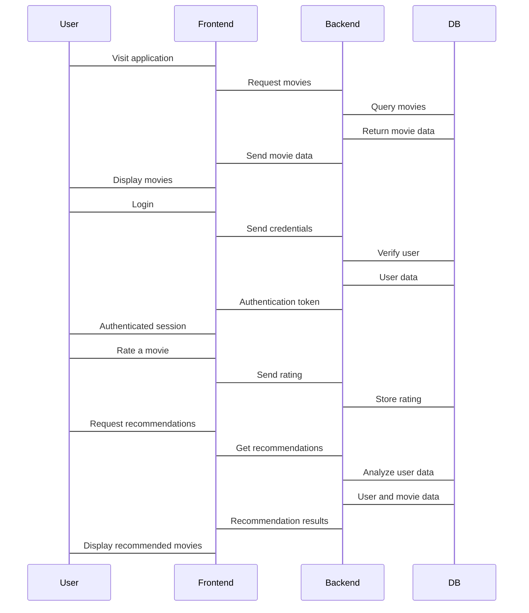

# Overview

> **Relevant source files**
> * [.gitattributes](https://github.com/zsqgleRoy/MoviesRecommand/blob/49b41f2a/.gitattributes)
> * [MovieRecomandAPP/README.md](https://github.com/zsqgleRoy/MoviesRecommand/blob/49b41f2a/MovieRecomandAPP/README.md)
> * [README.md](https://github.com/zsqgleRoy/MoviesRecommand/blob/49b41f2a/README.md)
> * [movie_db.sql](https://github.com/zsqgleRoy/MoviesRecommand/blob/49b41f2a/movie_db.sql)

This document provides an introduction to the MovieRecommendation system, explaining its purpose, architecture, and main components. For detailed information about specific components, please refer to their respective wiki pages.

## Purpose

The MovieRecommendation system is a web application designed to provide personalized movie recommendations to users based on their preferences and ratings. Users can browse a catalog of movies, view details, rate movies, and receive tailored recommendations based on their taste profile.

Sources: [README.md](https://github.com/zsqgleRoy/MoviesRecommand/blob/49b41f2a/README.md)

 [MovieRecomandAPP/README.md](https://github.com/zsqgleRoy/MoviesRecommand/blob/49b41f2a/MovieRecomandAPP/README.md)

## System Architecture

### High-Level Architecture Diagram

```

```

The MovieRecommendation system follows a three-tier architecture consisting of a database layer, backend API server, and frontend Vue application. This separation of concerns provides a scalable and maintainable structure.

Sources: [MovieRecomandAPP/README.md](https://github.com/zsqgleRoy/MoviesRecommand/blob/49b41f2a/MovieRecomandAPP/README.md)

 [movie_db.sql](https://github.com/zsqgleRoy/MoviesRecommand/blob/49b41f2a/movie_db.sql)

## Main Components

### Database

The system uses a SQL database (stored in `movie_db.sql`) that contains tables for movies, users, ratings, reviews, actors, directors, and genres. This database is over 600MB in size and is managed using Git LFS to handle the large file size efficiently.

For detailed information about the database schema and entity relationships, see [Database](/zsqgleRoy/MoviesRecommand/2-database) and [Database Schema](/zsqgleRoy/MoviesRecommand/2.1-database-schema).

Sources: [movie_db.sql](https://github.com/zsqgleRoy/MoviesRecommand/blob/49b41f2a/movie_db.sql)

 [.gitattributes

1](https://github.com/zsqgleRoy/MoviesRecommand/blob/49b41f2a/.gitattributes#L1-L1)

### Backend

The backend of the MovieRecommendation system is built using Express.js, which provides API endpoints for the frontend to interact with. Key services include:

* Authentication Service: Handles user registration and login
* Movie Service: Provides movie information and search functionality
* Recommendation Engine: Generates personalized movie recommendations based on user ratings and preferences

Sources: Based on repository analysis and architecture diagrams

### Frontend

The frontend application (`MovieRecomandAPP`) is built using Vue 3 and Vite. It provides the user interface for interacting with the system.

### Frontend Component Structure


For more detailed information about the frontend application, see [Frontend Application](/zsqgleRoy/MoviesRecommand/3-frontend-application).

Sources: [MovieRecomandAPP/README.md](https://github.com/zsqgleRoy/MoviesRecommand/blob/49b41f2a/MovieRecomandAPP/README.md)

## Technology Stack

The MovieRecommendation system uses the following technologies:

| Component | Technologies |
| --- | --- |
| Frontend | Vue 3, Vite, Vue Router, Pinia, Element Plus, Tailwind CSS, TypeScript |
| Backend | Express.js, Node.js |
| Database | MySQL |
| DevOps | Git, Git LFS |

Sources: [MovieRecomandAPP/README.md L1-L15](https://github.com/zsqgleRoy/MoviesRecommand/blob/49b41f2a/MovieRecomandAPP/README.md#L1-L15)

## Data Flow

### User Interaction Flow Diagram



This sequence diagram illustrates the data flow during key user interactions with the system, including browsing movies, authentication, rating movies, and receiving recommendations.

Sources: Based on system architecture analysis

## Development Setup

To set up the MovieRecommendation system for development:

1. Clone the repository from [https://github.com/zsqgleRoy/MoviesRecommand](https://github.com/zsqgleRoy/MoviesRecommand)
2. Set up the database using `movie_db.sql`
3. Set up the frontend application:

```
cd MovieRecomandAPP
npm install
npm run dev
```

For detailed setup instructions, see [Frontend Setup and Installation](/zsqgleRoy/MoviesRecommand/3.1-setup-and-installation).

Sources: [MovieRecomandAPP/README.md L17-L27](https://github.com/zsqgleRoy/MoviesRecommand/blob/49b41f2a/MovieRecomandAPP/README.md#L17-L27)

## Git LFS Configuration

The repository uses Git Large File Storage (LFS) for managing the large SQL database file. The configuration is specified in the `.gitattributes` file:

```
*.sql filter=lfs diff=lfs merge=lfs -text
```

This configuration ensures that SQL files are tracked by Git LFS rather than regular Git, which is essential for managing large files efficiently.

For more information about the development workflow, see [Development Workflow](/zsqgleRoy/MoviesRecommand/1.2-development-workflow).

Sources: [.gitattributes

1](https://github.com/zsqgleRoy/MoviesRecommand/blob/49b41f2a/.gitattributes#L1-L1)