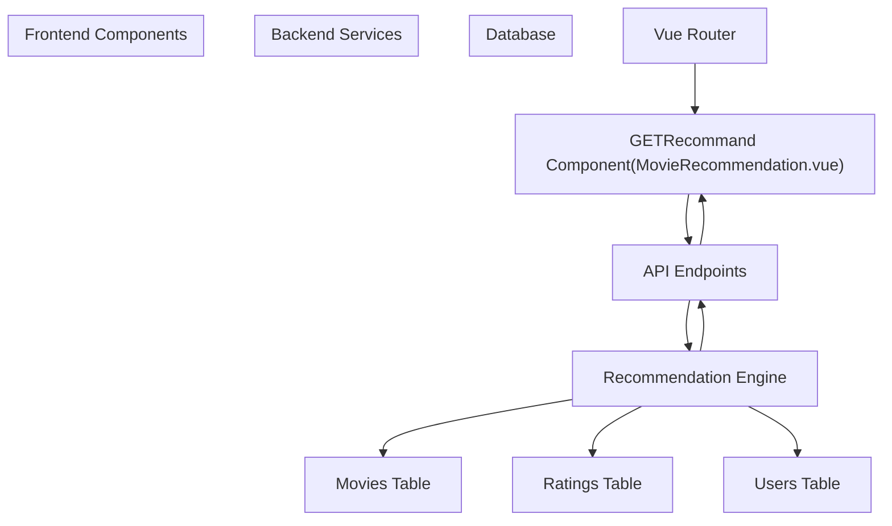
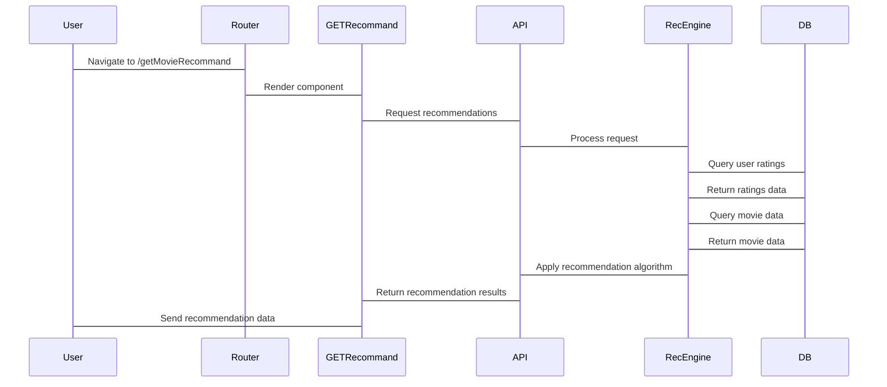

# Recommendations

> **Relevant source files**
> * [MovieRecomandAPP/src/router/index.ts](https://github.com/zsqgleRoy/MoviesRecommand/blob/49b41f2a/MovieRecomandAPP/src/router/index.ts)
> * [README.md](https://github.com/zsqgleRoy/MoviesRecommand/blob/49b41f2a/README.md)

This document provides technical documentation of the movie recommendation system in the MoviesRecommand project. The recommendation system generates personalized movie suggestions based on user preferences and behavior.

For information about how users rate movies, which provides input data for the recommendation system, see [Movie Rating](/zsqgleRoy/MoviesRecommand/4.3-movie-rating).

## System Architecture

The recommendation system operates across frontend and backend layers, with a dedicated route and component for displaying personalized movie suggestions.



Sources: [MovieRecomandAPP/src/router/index.ts

3](https://github.com/zsqgleRoy/MoviesRecommand/blob/49b41f2a/MovieRecomandAPP/src/router/index.ts#L3-L3)

 [MovieRecomandAPP/src/router/index.ts L64-L67](https://github.com/zsqgleRoy/MoviesRecommand/blob/49b41f2a/MovieRecomandAPP/src/router/index.ts#L64-L67)

## Recommendation Process Flow

The recommendation process follows this sequence of operations:



Sources: [MovieRecomandAPP/src/router/index.ts

3](https://github.com/zsqgleRoy/MoviesRecommand/blob/49b41f2a/MovieRecomandAPP/src/router/index.ts#L3-L3)

 [MovieRecomandAPP/src/router/index.ts L64-L67](https://github.com/zsqgleRoy/MoviesRecommand/blob/49b41f2a/MovieRecomandAPP/src/router/index.ts#L64-L67)

## Frontend Implementation

### Route Configuration

The recommendation feature is accessed through a dedicated route defined in the Vue Router configuration:

```
{
  path: '/getMovieRecommand',
  name: 'getMovieRecommand',
  component: GETRecommand,
}
```

This route renders the `GETRecommand` component, which is imported from `@/views/MovieRecommendation.vue`.

Sources: [MovieRecomandAPP/src/router/index.ts

3](https://github.com/zsqgleRoy/MoviesRecommand/blob/49b41f2a/MovieRecomandAPP/src/router/index.ts#L3-L3)

 [MovieRecomandAPP/src/router/index.ts L64-L67](https://github.com/zsqgleRoy/MoviesRecommand/blob/49b41f2a/MovieRecomandAPP/src/router/index.ts#L64-L67)

### Recommendation Component

The `MovieRecommendation.vue` component (imported as `GETRecommand`) is responsible for:

1. Requesting personalized recommendations from the backend API
2. Rendering the recommended movies to the user
3. Managing user interactions with the recommendations

Based on standard Vue component structure, this component likely contains:

* Template section for displaying movie recommendations
* Script section with API call logic and state management
* Style section for recommendation display formatting

Sources: [MovieRecomandAPP/src/router/index.ts

3](https://github.com/zsqgleRoy/MoviesRecommand/blob/49b41f2a/MovieRecomandAPP/src/router/index.ts#L3-L3)

## Integration Points

The recommendation system integrates with other components of the application as follows:

| Component | Integration Description |
| --- | --- |
| Vue Router | Defines the `/getMovieRecommand` route that renders the recommendation component |
| Backend API | Provides endpoints that generate and return personalized recommendations |
| Database | Stores movie data and user ratings used to generate recommendations |
| User Authentication | Identifies the user to provide personalized recommendations |

Sources: [MovieRecomandAPP/src/router/index.ts

3](https://github.com/zsqgleRoy/MoviesRecommand/blob/49b41f2a/MovieRecomandAPP/src/router/index.ts#L3-L3)

 [MovieRecomandAPP/src/router/index.ts L64-L67](https://github.com/zsqgleRoy/MoviesRecommand/blob/49b41f2a/MovieRecomandAPP/src/router/index.ts#L64-L67)

## Data Requirements

The recommendation system requires the following data to function properly:

| Data | Purpose | Source |
| --- | --- | --- |
| User ID | Identifies the user for personalization | Authentication system |
| User Ratings | Provides preference data for recommendations | Ratings table |
| Movie Metadata | Supplies details about recommended movies | Movies table |
| User Viewing History | May factor into recommendation algorithm | User activity logs |

This data is processed by the recommendation engine to generate relevant movie suggestions tailored to individual users.

Sources: [MovieRecomandAPP/src/router/index.ts

3](https://github.com/zsqgleRoy/MoviesRecommand/blob/49b41f2a/MovieRecomandAPP/src/router/index.ts#L3-L3)

 [MovieRecomandAPP/src/router/index.ts L64-L67](https://github.com/zsqgleRoy/MoviesRecommand/blob/49b41f2a/MovieRecomandAPP/src/router/index.ts#L64-L67)

## Technical Considerations

When working with the recommendation system, developers should consider:

1. **Performance optimization**: Recommendation generation can be computationally intensive
2. **Caching strategy**: Recommendations may be cached to reduce processing time
3. **User authentication**: The system requires user identification for personalization
4. **Algorithm tuning**: The recommendation algorithm may need adjustment based on user feedback

These considerations help ensure the recommendation system operates efficiently while providing relevant suggestions to users.