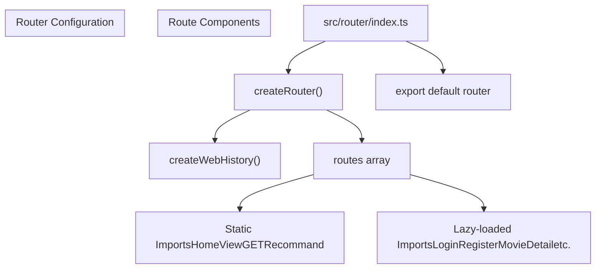
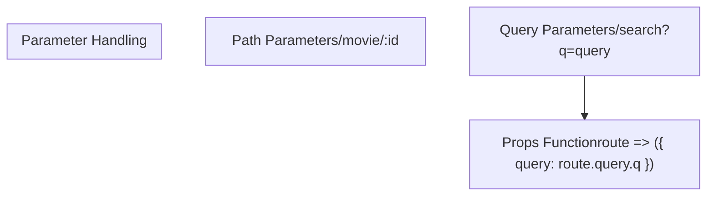
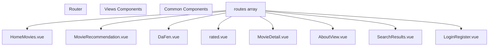
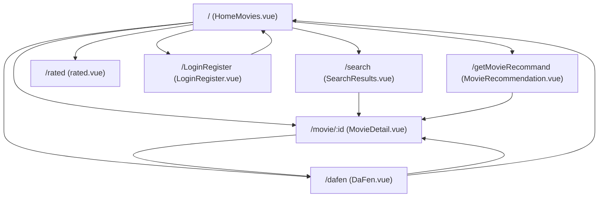
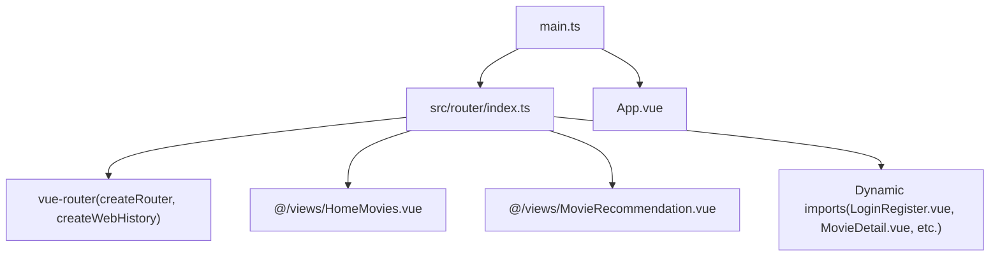

# Routing

> **Relevant source files**
> * [MovieRecomandAPP/src/router/index.ts](https://github.com/zsqgleRoy/MoviesRecommand/blob/49b41f2a/MovieRecomandAPP/src/router/index.ts)

## Purpose and Scope

This document details the routing system implemented in the MoviesRecommand application. It covers the Vue Router configuration, route definitions, navigation flow, and how routes connect to various components in the application. For information about the component architecture itself, see [Component Architecture](/zsqgleRoy/MoviesRecommand/3.2-component-architecture). For details on API integration with these routes, see [API Integration](/zsqgleRoy/MoviesRecommand/3.5-api-integration).

## Router Technology

The MoviesRecommand application uses Vue Router, the official router for Vue.js applications. Specifically, it implements the Vue Router 4.x version designed for Vue 3, utilizing the Composition API.

The router is configured using the `createRouter` function with HTML5 History mode via `createWebHistory`, enabling clean URLs without the hash (#) symbol.

Sources: [MovieRecomandAPP/src/router/index.ts L1-L6](https://github.com/zsqgleRoy/MoviesRecommand/blob/49b41f2a/MovieRecomandAPP/src/router/index.ts#L1-L6)

## Router Configuration

The router configuration is centralized in a single file:

The router configuration employs HTML5 History mode for clean URLs and defines all available route paths. It uses two component importing strategies:

1. **Static Imports**: For frequently accessed components like the home page and recommendation page
2. **Lazy-loaded Imports**: For components that don't need to be loaded immediately, using dynamic imports to improve initial load performance

Sources: [MovieRecomandAPP/src/router/index.ts L1-L82](https://github.com/zsqgleRoy/MoviesRecommand/blob/49b41f2a/MovieRecomandAPP/src/router/index.ts#L1-L82)

## Route Definitions

The application defines multiple routes to handle different views and functionality:

| Path | Name | Component | Loading Strategy | Notes |
| --- | --- | --- | --- | --- |
| `/` | home | HomeView | Static | Main landing page |
| `/LoginRegister` | loginRegister | LoginRegister.vue | Lazy-loaded | User authentication |
| `/new` | new | LoginRegister.vue | Lazy-loaded | Same component as login |
| `/dafen` | dafen | DaFen.vue | Lazy-loaded | Rating interface |
| `/hot` | hot | LoginRegister.vue | Lazy-loaded | Same component as login |
| `/rated` | rated | rated.vue | Lazy-loaded | User rated movies |
| `/movie/:id` | movie_detail | MovieDetail.vue | Lazy-loaded | Movie details with parameter |
| `/like` | like | LoginRegister.vue | Lazy-loaded | Same component as login |
| `/movies` | movies | LoginRegister.vue | Lazy-loaded | Same component as login |
| `/movies/:id` | movie | LoginRegister.vue | Lazy-loaded | Same component as login |
| `/contact` | contact | LoginRegister.vue | Lazy-loaded | Same component as login |
| `/getMovieRecommand` | getMovieRecommand | GETRecommand | Static | Movie recommendations |
| `/about` | about | AboutView.vue | Lazy-loaded | About page |
| `/search` | SearchResults | SearchResults.vue | Lazy-loaded | Search results with query props |

Sources: [MovieRecomandAPP/src/router/index.ts L7-L79](https://github.com/zsqgleRoy/MoviesRecommand/blob/49b41f2a/MovieRecomandAPP/src/router/index.ts#L7-L79)

### Route Parameter Handling

The router implements two parameter passing strategies:

1. **Path Parameters**: Used in routes like `/movie/:id` where the ID is part of the URL path
2. **Query Parameters**: Used in the search route where query parameters are passed via the URL query string and converted to props

Sources: [MovieRecomandAPP/src/router/index.ts L39-L41](https://github.com/zsqgleRoy/MoviesRecommand/blob/49b41f2a/MovieRecomandAPP/src/router/index.ts#L39-L41)

 [MovieRecomandAPP/src/router/index.ts L74-L78](https://github.com/zsqgleRoy/MoviesRecommand/blob/49b41f2a/MovieRecomandAPP/src/router/index.ts#L74-L78)

## Route Component Mapping

The following diagram visualizes how routes map to specific components in the application:

Note that the `LoginRegister.vue` component is mapped to multiple routes, suggesting that some routes may be placeholder routes or require authentication.

Sources: [MovieRecomandAPP/src/router/index.ts L7-L79](https://github.com/zsqgleRoy/MoviesRecommand/blob/49b41f2a/MovieRecomandAPP/src/router/index.ts#L7-L79)

## Navigation Flow

The typical user navigation flow through the application:

This diagram illustrates the primary navigation paths users can take through the application, showing how different routes are connected in terms of user flow.

Sources: [MovieRecomandAPP/src/router/index.ts L7-L79](https://github.com/zsqgleRoy/MoviesRecommand/blob/49b41f2a/MovieRecomandAPP/src/router/index.ts#L7-L79)

## Router Import Structure

The router module's import structure and how it's exported for use in the application:

The router is defined in `src/router/index.ts` and exported as a default export. It's then imported in the main application entry point and attached to the Vue application instance.

Sources: [MovieRecomandAPP/src/router/index.ts L1-L82](https://github.com/zsqgleRoy/MoviesRecommand/blob/49b41f2a/MovieRecomandAPP/src/router/index.ts#L1-L82)

## Router Implementation Notes

1. **Static vs. Lazy Loading**:

* Static imports are used for essential components (Home, Recommendations)
* Lazy-loaded components use the dynamic import syntax: `() => import('path/to/component')`
2. **Route Naming**:

* Each route has a unique name that can be used for programmatic navigation
* Names follow a consistent pattern (lowercase, descriptive of the route's purpose)
3. **Path Parameters**:

* Dynamic segments in paths are denoted with a colon (`:id`)
* Query parameters are handled via props functions
4. **Component Reuse**:

* `LoginRegister.vue` is mapped to multiple routes, indicating potential placeholder routes or authentication requirements

Sources: [MovieRecomandAPP/src/router/index.ts L7-L79](https://github.com/zsqgleRoy/MoviesRecommand/blob/49b41f2a/MovieRecomandAPP/src/router/index.ts#L7-L79)