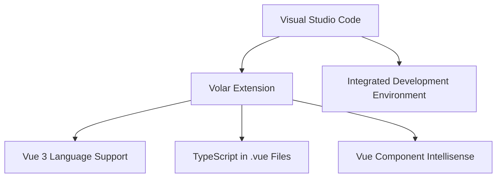
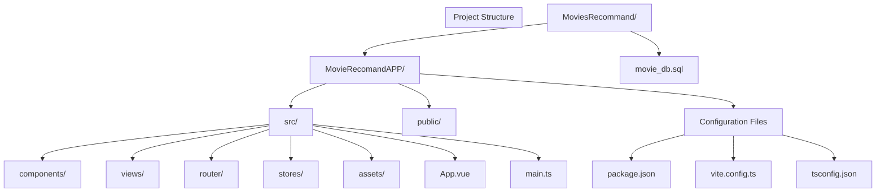
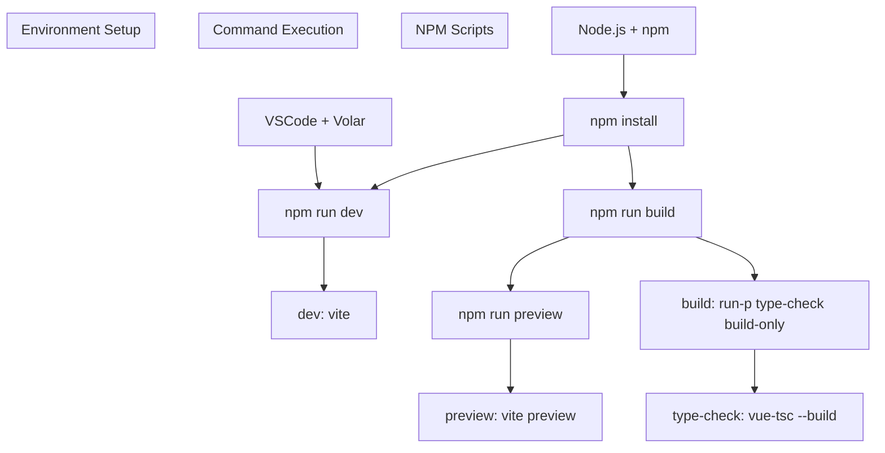

# Setup and Installation

> **Relevant source files**
> * [MovieRecomandAPP/.vscode/extensions.json](https://github.com/zsqgleRoy/MoviesRecommand/blob/49b41f2a/MovieRecomandAPP/.vscode/extensions.json)
> * [MovieRecomandAPP/README.md](https://github.com/zsqgleRoy/MoviesRecommand/blob/49b41f2a/MovieRecomandAPP/README.md)
> * [MovieRecomandAPP/package.json](https://github.com/zsqgleRoy/MoviesRecommand/blob/49b41f2a/MovieRecomandAPP/package.json)

This document provides detailed instructions for setting up and installing the Vue.js frontend application of the MovieRecommendation system. It covers environment setup, dependencies installation, and launching the application in different modes. For information about the backend components, see [Database](/zsqgleRoy/MoviesRecommand/2-database), and for details about the frontend architecture, see [Component Architecture](/zsqgleRoy/MoviesRecommand/3.2-component-architecture).

## Prerequisites

Before proceeding with installation, ensure you have the following software installed:

* Node.js (v14 or later)
* npm (Node Package Manager)
* Git (with Git LFS configured for SQL files)
* IDE (preferably Visual Studio Code with Vue extensions)

## Development Environment Setup

The recommended development environment for the MovieRecommendation frontend is:

### IDE Setup



1. Install [Visual Studio Code](https://code.visualstudio.com/)
2. Install the Volar extension as recommended in the project configuration
3. Ensure Vetur is disabled if previously installed (to avoid conflicts)

Sources: [MovieRecomandAPP/README.md L5-L7](https://github.com/zsqgleRoy/MoviesRecommand/blob/49b41f2a/MovieRecomandAPP/README.md#L5-L7)

 [MovieRecomandAPP/.vscode/extensions.json

1-3](https://github.com/zsqgleRoy/MoviesRecommand/blob/49b41f2a/MovieRecomandAPP/.vscode/extensions.json#L1-L3)

## Installation Process

### Step 1: Clone the Repository

```
git clone https://github.com/zsqgleRoy/MoviesRecommand.git
cd MoviesRecommand
```

### Step 2: Frontend Installation

Navigate to the frontend application directory and install dependencies:

```
cd MovieRecomandAPP
npm install
```

This will install all required packages defined in the package.json file.

Sources: [MovieRecomandAPP/README.md L17-L21](https://github.com/zsqgleRoy/MoviesRecommand/blob/49b41f2a/MovieRecomandAPP/README.md#L17-L21)

## Project Structure

The MovieRecommendation system consists of a Vue 3 frontend application that connects to a backend API.



Sources: [MovieRecomandAPP/README.md L1-L4](https://github.com/zsqgleRoy/MoviesRecommand/blob/49b41f2a/MovieRecomandAPP/README.md#L1-L4)

 [MovieRecomandAPP/package.json L1-L41](https://github.com/zsqgleRoy/MoviesRecommand/blob/49b41f2a/MovieRecomandAPP/package.json#L1-L41)

## Technology Stack

The frontend application is built with the following technologies:

| Technology | Version | Purpose |
| --- | --- | --- |
| Vue.js | 3.5.13 | Frontend framework |
| Vite | 6.2.4 | Build tool and development server |
| TypeScript | 5.8.0 | Type safety and modern JavaScript features |
| Vue Router | 4.5.1 | Application routing |
| Pinia | 3.0.1 | State management |
| Element Plus | 2.9.9 | UI component library |
| Tailwind CSS | 4.1.4 | Utility-first CSS framework |
| Axios | 1.9.0 | HTTP client for API requests |

Sources: [MovieRecomandAPP/package.json L13-L26](https://github.com/zsqgleRoy/MoviesRecommand/blob/49b41f2a/MovieRecomandAPP/package.json#L13-L26)

## Running the Application



### Development Mode

To run the application in development mode with hot-reload:

```
npm run dev
```

This command starts the Vite development server, making the application available at `http://localhost:5173` by default.

Sources: [MovieRecomandAPP/README.md L22-L27](https://github.com/zsqgleRoy/MoviesRecommand/blob/49b41f2a/MovieRecomandAPP/README.md#L22-L27)

 [MovieRecomandAPP/package.json

7](https://github.com/zsqgleRoy/MoviesRecommand/blob/49b41f2a/MovieRecomandAPP/package.json#L7-L7)

### Production Build

To build the application for production deployment:

```
npm run build
```

This command performs type checking and creates an optimized production build in the `dist` directory.

Sources: [MovieRecomandAPP/README.md L28-L33](https://github.com/zsqgleRoy/MoviesRecommand/blob/49b41f2a/MovieRecomandAPP/README.md#L28-L33)

 [MovieRecomandAPP/package.json L8-L11](https://github.com/zsqgleRoy/MoviesRecommand/blob/49b41f2a/MovieRecomandAPP/package.json#L8-L11)

### Previewing Production Build

To preview the production build locally:

```
npm run preview
```

This is useful for testing the production build before deployment.

Sources: [MovieRecomandAPP/package.json

9](https://github.com/zsqgleRoy/MoviesRecommand/blob/49b41f2a/MovieRecomandAPP/package.json#L9-L9)

## Dependencies and Configuration

The MovieRecommendation frontend relies on several key dependencies:

### Frontend Dependencies

* **Vue 3**: Progressive JavaScript framework
* **Vue Router**: Official router for Vue.js
* **Pinia**: State management library for Vue
* **Element Plus**: UI component library
* **Tailwind CSS**: Utility-first CSS framework
* **Axios**: Promise-based HTTP client

### Backend Integration Dependencies

* **Express**: Web application framework
* **MySQL2**: MySQL client for Node.js
* **CORS**: Cross-Origin Resource Sharing middleware
* **HTTP-Proxy-Middleware**: For development API proxying

Sources: [MovieRecomandAPP/package.json L13-L26](https://github.com/zsqgleRoy/MoviesRecommand/blob/49b41f2a/MovieRecomandAPP/package.json#L13-L26)

## Troubleshooting

### Common Issues

1. **Port Conflicts**:

* If port 5173 is already in use, Vite will automatically try the next available port
* You can manually specify a port in the Vite configuration
2. **TypeScript Errors**:

* Ensure Volar extension is properly installed
* The project uses `vue-tsc` for TypeScript checking in `.vue` files
3. **Dependency Issues**:

* If you encounter package conflicts or errors, try removing `node_modules` and `package-lock.json`, then run `npm install` again
4. **Build Failures**:

* Check TypeScript errors first (`npm run type-check`)
* Verify that all imports are correctly resolved

Sources: [MovieRecomandAPP/README.md L10-L12](https://github.com/zsqgleRoy/MoviesRecommand/blob/49b41f2a/MovieRecomandAPP/README.md#L10-L12)

 [MovieRecomandAPP/package.json

11](https://github.com/zsqgleRoy/MoviesRecommand/blob/49b41f2a/MovieRecomandAPP/package.json#L11-L11)

## Conclusion

Following these installation and setup instructions should successfully prepare your development environment for working with the MovieRecommendation frontend application. After installation, refer to [Component Architecture](/zsqgleRoy/MoviesRecommand/3.2-component-architecture) for details about the system's components and how they interact.