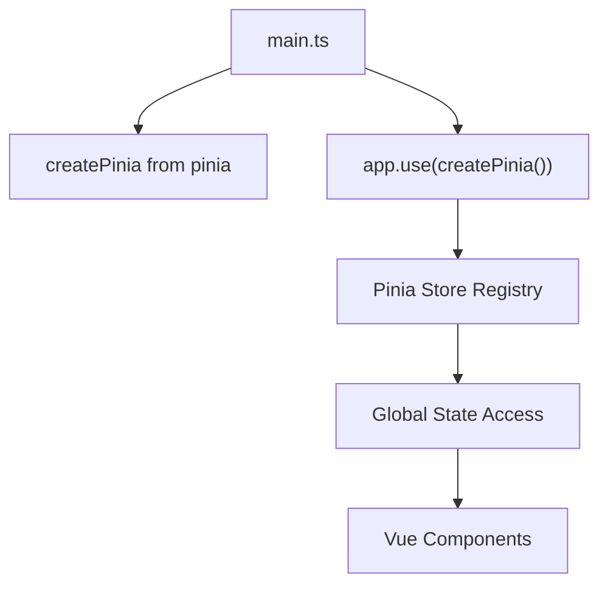
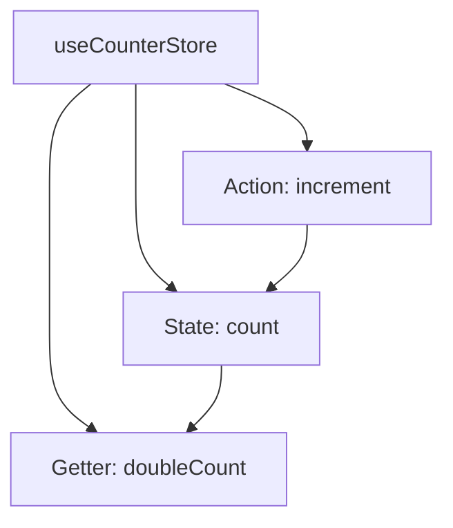
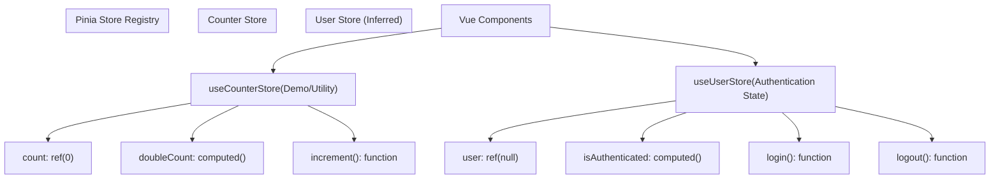
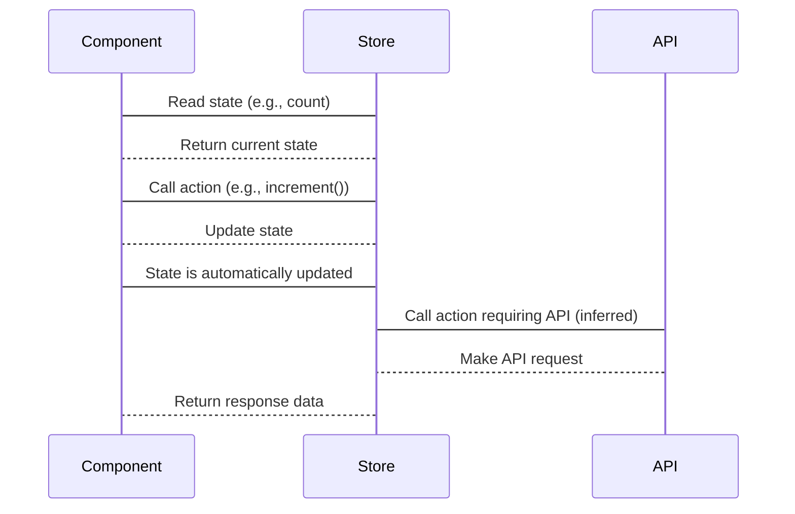
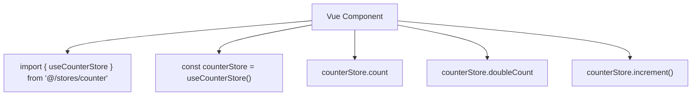
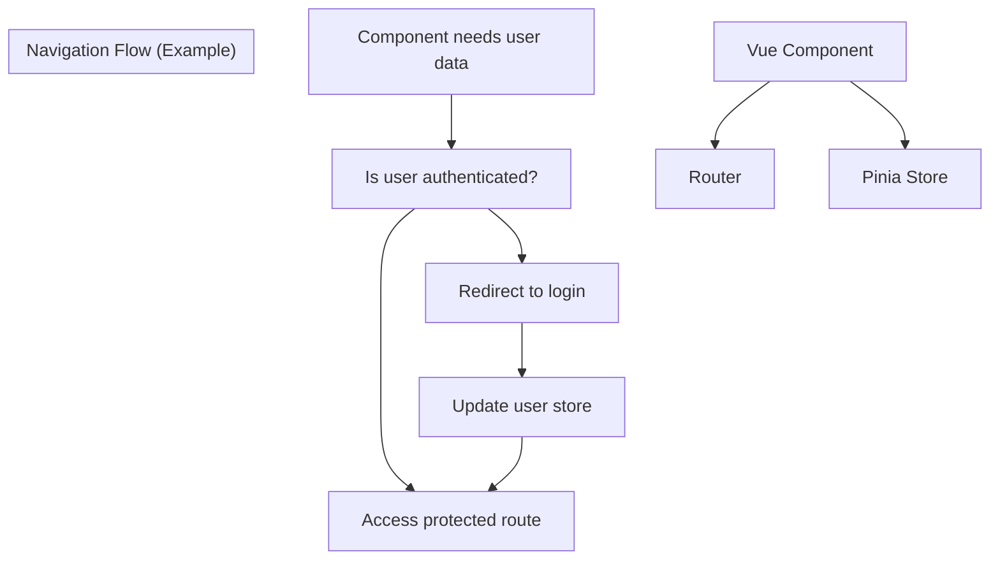

# State Management

> **Relevant source files**
> * [MovieRecomandAPP/src/main.ts](https://github.com/zsqgleRoy/MoviesRecommand/blob/49b41f2a/MovieRecomandAPP/src/main.ts)
> * [MovieRecomandAPP/src/stores/counter.ts](https://github.com/zsqgleRoy/MoviesRecommand/blob/49b41f2a/MovieRecomandAPP/src/stores/counter.ts)

This page documents the state management approach used in the MovieRecommand application. It covers how Pinia is implemented as the state management solution, the structure of the stores, and the data flow between components and stores. For information about API integration with these stores, see [API Integration](/zsqgleRoy/MoviesRecommand/3.5-api-integration).

## Pinia Overview

The MovieRecommand application uses Pinia as its state management library. Pinia is the officially recommended state management solution for Vue 3 applications, providing a simpler and more type-safe alternative to Vuex.

Pinia is integrated into the application in the main entry point:

Sources: [MovieRecomandAPP/src/main.ts

4](https://github.com/zsqgleRoy/MoviesRecommand/blob/49b41f2a/MovieRecomandAPP/src/main.ts#L4-L4)

 [MovieRecomandAPP/src/main.ts

14](https://github.com/zsqgleRoy/MoviesRecommand/blob/49b41f2a/MovieRecomandAPP/src/main.ts#L14-L14)

## Store Implementation

The stores in MovieRecommand are implemented using the Composition API style of Pinia, which provides a more concise and intuitive approach to state management.

### Counter Store Example

The application contains a basic counter store that demonstrates the core concepts of Pinia:

Sources: [MovieRecomandAPP/src/stores/counter.ts L1-L12](https://github.com/zsqgleRoy/MoviesRecommand/blob/49b41f2a/MovieRecomandAPP/src/stores/counter.ts#L1-L12)

The counter store is defined using the `defineStore` function from Pinia, with a unique store ID ('counter') and a setup function that returns the state, getters, and actions:

* **State**: The `count` variable defined using `ref(0)`
* **Getter**: The `doubleCount` computed property that returns double the current count
* **Action**: The `increment` function that modifies the state

### Store Architecture

Based on the system diagrams, the application appears to have at least two stores:

Sources: [MovieRecomandAPP/src/stores/counter.ts L4-L12](https://github.com/zsqgleRoy/MoviesRecommand/blob/49b41f2a/MovieRecomandAPP/src/stores/counter.ts#L4-L12)

## State Management Flow

The following diagram illustrates how state management works in the MovieRecommand application:

Sources: [MovieRecomandAPP/src/stores/counter.ts L4-L12](https://github.com/zsqgleRoy/MoviesRecommand/blob/49b41f2a/MovieRecomandAPP/src/stores/counter.ts#L4-L12)

## Accessing Stores in Components

To use a store in a component, it needs to be imported and instantiated. The following diagram shows this process:

Sources: [MovieRecomandAPP/src/stores/counter.ts L4-L12](https://github.com/zsqgleRoy/MoviesRecommand/blob/49b41f2a/MovieRecomandAPP/src/stores/counter.ts#L4-L12)

## Best Practices for State Management

Based on the project structure, the following best practices are recommended for state management in the MovieRecommand application:

| Practice | Description |
| --- | --- |
| Store Modularity | Each store should have a single responsibility (e.g., counter store, user store) |
| Composition API Style | Use the composition API style for defining stores, as demonstrated in the counter store |
| Type Safety | Leverage TypeScript for type safety in store definitions |
| Consistent Naming | Use the `use[StoreName]Store` naming convention for store functions |
| State Access | Access store state directly through the store instance (e.g., `counterStore.count`) |

Sources: [MovieRecomandAPP/src/stores/counter.ts L4-L12](https://github.com/zsqgleRoy/MoviesRecommand/blob/49b41f2a/MovieRecomandAPP/src/stores/counter.ts#L4-L12)

## Integration with Vue Router

State management works in conjunction with the router to manage application state across different views. For example, authentication state in the user store would likely be used to control access to protected routes.

Sources: [MovieRecomandAPP/src/main.ts L14-L15](https://github.com/zsqgleRoy/MoviesRecommand/blob/49b41f2a/MovieRecomandAPP/src/main.ts#L14-L15)

## Summary

The MovieRecommand application uses Pinia for state management, implementing stores using the Composition API style. The counter store provides a basic example of state, getters, and actions, while the inferred user store likely manages authentication state. Components access these stores to read state and trigger actions, creating a centralized and reactive state management system throughout the application.