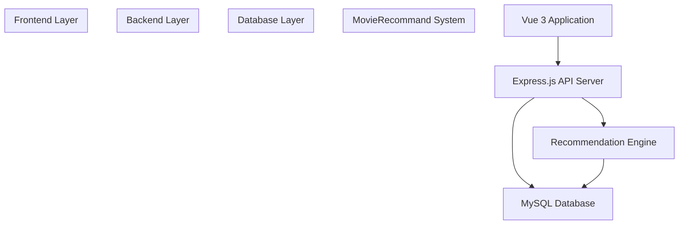
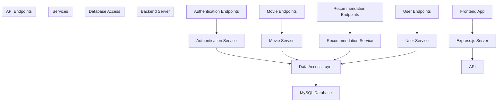
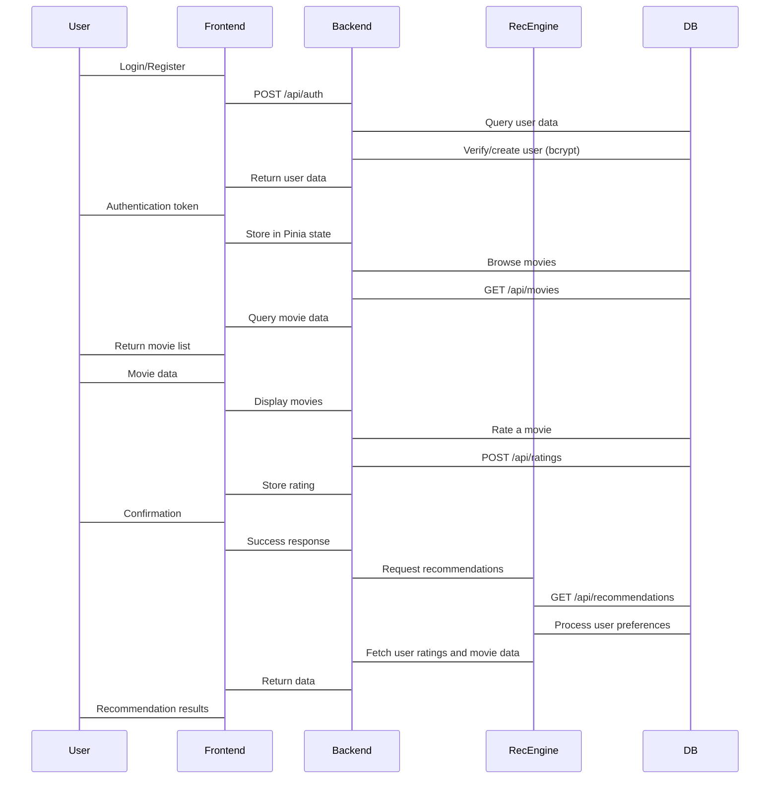
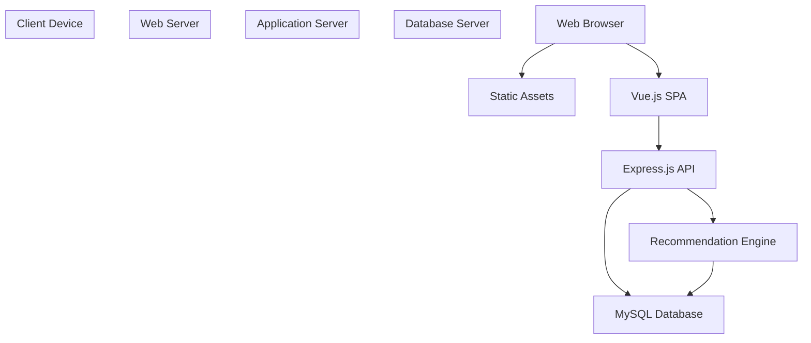

# System Architecture

> **Relevant source files**
> * [MovieRecomandAPP/package.json](https://github.com/zsqgleRoy/MoviesRecommand/blob/49b41f2a/MovieRecomandAPP/package.json)
> * [MovieRecomandAPP/src/main.ts](https://github.com/zsqgleRoy/MoviesRecommand/blob/49b41f2a/MovieRecomandAPP/src/main.ts)
> * [README.md](https://github.com/zsqgleRoy/MoviesRecommand/blob/49b41f2a/README.md)
> * [movie_db.sql](https://github.com/zsqgleRoy/MoviesRecommand/blob/49b41f2a/movie_db.sql)

This document provides a comprehensive overview of the MoviesRecommand system architecture, detailing how the frontend, backend, and database components interact. It covers the technical structure and key relationships between system components. For information about the development workflow, see [Development Workflow](/zsqgleRoy/MoviesRecommand/1.2-development-workflow).

## Overview

The MoviesRecommand system consists of three primary layers:

1. **Frontend** - A Vue 3 application that provides the user interface
2. **Backend** - An Express.js server that handles API requests and business logic
3. **Database** - A MySQL database that stores movie data, user information, ratings, and other related data



Sources: [MovieRecomandAPP/package.json L1-L41](https://github.com/zsqgleRoy/MoviesRecommand/blob/49b41f2a/MovieRecomandAPP/package.json#L1-L41)

 [movie_db.sql L1-L4](https://github.com/zsqgleRoy/MoviesRecommand/blob/49b41f2a/movie_db.sql#L1-L4)

## Technology Stack

The system utilizes the following technologies:

| Layer | Technologies |
| --- | --- |
| Frontend | Vue 3, Vite, Pinia, Vue Router, Element Plus, Tailwind CSS |
| Backend | Express.js, Node.js |
| Database | MySQL |
| API Communication | Axios |
| Authentication | bcrypt |

Sources: [MovieRecomandAPP/package.json L13-L26](https://github.com/zsqgleRoy/MoviesRecommand/blob/49b41f2a/MovieRecomandAPP/package.json#L13-L26)

## Frontend Architecture

The frontend is a Vue 3 single-page application with the following key components:

```mermaid
flowchart TD

subgraph Frontend_Application ["Frontend Application"]
end

subgraph Core_Modules ["Core Modules"]
end

subgraph Components ["Components"]
end

subgraph Views ["Views"]
end

MC["Movie Card"]
PC["Person Card"]
SB["Search Bar"]
LR["Login/Register"]
App["App.vue (Root Component)"]
Router["Vue Router"]
Store["Pinia Store"]
API["API Service (axios)"]
Backend["Backend API"]
HV["Home View"]
MD["Movie Detail"]
SR["Search Results"]
RV["Recommendation View"]
UI["Element Plus Components"]

    App --> Router
    App --> Store
    API --> Backend
```



The frontend application initializes with an entry point in `main.ts`, which sets up Vue with the necessary plugins including Pinia for state management, Vue Router for navigation, and Element Plus for UI components.

Sources: [MovieRecomandAPP/src/main.ts L1-L17](https://github.com/zsqgleRoy/MoviesRecommand/blob/49b41f2a/MovieRecomandAPP/src/main.ts#L1-L17)

 [MovieRecomandAPP/package.json L13-L26](https://github.com/zsqgleRoy/MoviesRecommand/blob/49b41f2a/MovieRecomandAPP/package.json#L13-L26)

## Backend Architecture

The backend serves as an API gateway between the frontend and the database, implementing business logic and the recommendation engine.



The Express.js server handles API requests, implements authentication using bcrypt, and provides endpoints for fetching movie data and generating recommendations.

Sources: [MovieRecomandAPP/package.json L16-L22](https://github.com/zsqgleRoy/MoviesRecommand/blob/49b41f2a/MovieRecomandAPP/package.json#L16-L22)

## Database Schema

The MySQL database stores all the data required for the movie recommendation system, including movie information, user data, ratings, and relationships between entities.

```
#mermaid-7u2g175r4h9{font-family:ui-sans-serif,-apple-system,system-ui,Segoe UI,Helvetica;font-size:16px;fill:#333;}@keyframes edge-animation-frame{from{stroke-dashoffset:0;}}@keyframes dash{to{stroke-dashoffset:0;}}#mermaid-7u2g175r4h9 .edge-animation-slow{stroke-dasharray:9,5!important;stroke-dashoffset:900;animation:dash 50s linear infinite;stroke-linecap:round;}#mermaid-7u2g175r4h9 .edge-animation-fast{stroke-dasharray:9,5!important;stroke-dashoffset:900;animation:dash 20s linear infinite;stroke-linecap:round;}#mermaid-7u2g175r4h9 .error-icon{fill:#dddddd;}#mermaid-7u2g175r4h9 .error-text{fill:#222222;stroke:#222222;}#mermaid-7u2g175r4h9 .edge-thickness-normal{stroke-width:1px;}#mermaid-7u2g175r4h9 .edge-thickness-thick{stroke-width:3.5px;}#mermaid-7u2g175r4h9 .edge-pattern-solid{stroke-dasharray:0;}#mermaid-7u2g175r4h9 .edge-thickness-invisible{stroke-width:0;fill:none;}#mermaid-7u2g175r4h9 .edge-pattern-dashed{stroke-dasharray:3;}#mermaid-7u2g175r4h9 .edge-pattern-dotted{stroke-dasharray:2;}#mermaid-7u2g175r4h9 .marker{fill:#999;stroke:#999;}#mermaid-7u2g175r4h9 .marker.cross{stroke:#999;}#mermaid-7u2g175r4h9 svg{font-family:ui-sans-serif,-apple-system,system-ui,Segoe UI,Helvetica;font-size:16px;}#mermaid-7u2g175r4h9 p{margin:0;}#mermaid-7u2g175r4h9 .entityBox{fill:#ffffff;stroke:#dddddd;}#mermaid-7u2g175r4h9 .relationshipLabelBox{fill:#dddddd;opacity:0.7;background-color:#dddddd;}#mermaid-7u2g175r4h9 .relationshipLabelBox rect{opacity:0.5;}#mermaid-7u2g175r4h9 .labelBkg{background-color:rgba(221, 221, 221, 0.5);}#mermaid-7u2g175r4h9 .edgeLabel .label{fill:#dddddd;font-size:14px;}#mermaid-7u2g175r4h9 .label{font-family:ui-sans-serif,-apple-system,system-ui,Segoe UI,Helvetica;color:#333;}#mermaid-7u2g175r4h9 .edge-pattern-dashed{stroke-dasharray:8,8;}#mermaid-7u2g175r4h9 .node rect,#mermaid-7u2g175r4h9 .node circle,#mermaid-7u2g175r4h9 .node ellipse,#mermaid-7u2g175r4h9 .node polygon{fill:#ffffff;stroke:#dddddd;stroke-width:1px;}#mermaid-7u2g175r4h9 .relationshipLine{stroke:#999;stroke-width:1;fill:none;}#mermaid-7u2g175r4h9 .marker{fill:none!important;stroke:#999!important;stroke-width:1;}#mermaid-7u2g175r4h9 :root{--mermaid-font-family:"trebuchet ms",verdana,arial,sans-serif;}hasgiveshaswritesfeaturesappears_indirected_bydirectscategorized_asincludesMOVIESintmovie_idPKstringtitledaterelease_datestringoverviewfloatpopularitystringposter_pathUSERSintuser_idPKstringusernamestringemailstringpassword_hashdateregistration_dateRATINGSintrating_idPKintuser_idFKintmovie_idFKfloatratingdatetimestampREVIEWSintreview_idPKintuser_idFKintmovie_idFKstringcontentdatetimestampACTORSintactor_idPKstringnamestringprofile_pathDIRECTORSintdirector_idPKstringnamestringprofile_pathGENRESintgenre_idPKstringnameMOVIE_ACTORSintmovie_idFKintactor_idFKMOVIE_DIRECTORSintmovie_idFKintdirector_idFKMOVIE_GENRESintmovie_idFKintgenre_idFK
```

The database schema includes tables for movies, users, ratings, reviews, actors, directors, and genres, with appropriate relationships between them.

Sources: [movie_db.sql L1-L4](https://github.com/zsqgleRoy/MoviesRecommand/blob/49b41f2a/movie_db.sql#L1-L4)

## Data Flow

The following diagram illustrates how data flows through the system during key operations:



Sources: [MovieRecomandAPP/package.json L13-L26](https://github.com/zsqgleRoy/MoviesRecommand/blob/49b41f2a/MovieRecomandAPP/package.json#L13-L26)

## System Integration Points

The MoviesRecommand system has several key integration points:

1. **Frontend to Backend Integration**: The Vue.js frontend communicates with the Express.js backend through RESTful API calls using axios.
2. **Backend to Database Integration**: The Express.js backend connects to the MySQL database using the mysql2 library to execute queries.
3. **Authentication Integration**: User authentication is handled using bcrypt for password hashing and verification.
4. **UI Component Integration**: The frontend utilizes Element Plus components for consistent UI elements and Tailwind CSS for styling.
5. **Recommendation Engine Integration**: The recommendation engine integrates with both the backend API and directly accesses the database to generate personalized movie recommendations.

Sources: [MovieRecomandAPP/package.json L13-L26](https://github.com/zsqgleRoy/MoviesRecommand/blob/49b41f2a/MovieRecomandAPP/package.json#L13-L26)

 [MovieRecomandAPP/src/main.ts L1-L17](https://github.com/zsqgleRoy/MoviesRecommand/blob/49b41f2a/MovieRecomandAPP/src/main.ts#L1-L17)

## Deployment Architecture

The application follows a standard three-tier architecture deployment model:



Sources: [MovieRecomandAPP/package.json L5-L12](https://github.com/zsqgleRoy/MoviesRecommand/blob/49b41f2a/MovieRecomandAPP/package.json#L5-L12)

## Conclusion

The MoviesRecommand system architecture employs a modern, component-based approach with clear separation between frontend, backend, and database layers. The Vue.js frontend provides a responsive user interface, the Express.js backend handles business logic and API requests, and the MySQL database stores all the necessary data for the movie recommendation system.

This architecture supports key features such as user authentication, movie browsing, rating, and personalized recommendations, while allowing for scalability and maintainability.

For more detailed information about specific components, refer to their respective documentation pages.